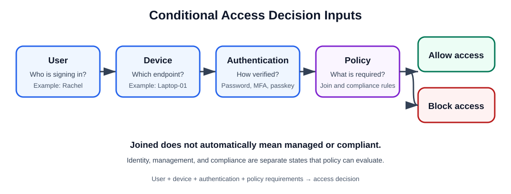

# Day 11: Microsoft Entra Device Identity and Registration

## Overview

This lesson explains how Windows devices establish identities in Microsoft Entra ID, how device identity contributes to Conditional Access decisions, and how to analyze and troubleshoot registration with `dsregcmd`.

The central idea is:

- **User identity:** Who is signing in? For example, Rachel's Microsoft Entra user object.
- **Device identity:** Which device is being used? For example, `Laptop-01`.
- **Access decision:** Can this user, on this device, access the requested resource?

Users and devices both have identities, and an access decision can use both. This connects directly to multifactor authentication (MFA) and Conditional Access.



## Device Registration States

There are three device identity states to recognize.

### 1. Microsoft Entra registered

- Usually a personal or Bring Your Own Device (BYOD) device
- A work account is connected to the device
- Simple relationship: **personal device → work account**
- Mental model: **“My PC + work account”**

### 2. Microsoft Entra joined

- Typically a corporate device in a cloud-first organization
- Joined directly to Microsoft Entra ID
- Usually organization-owned
- Simple relationship: **cloud-first**
- Mental model: **“Company cloud PC”**

### 3. Microsoft Entra hybrid joined

- An existing corporate domain device
- Joined to on-premises Active Directory (AD) and also registered with Microsoft Entra ID
- Usually organization-owned
- Simple relationship: **on-premises + cloud**
- Mental model: **“Company domain PC + cloud identity”**

> **Tip:** Identify the device's identity relationship first. Then consider its management and compliance state.

## Comparing Registered, Joined, and Hybrid Joined

| Characteristic | Microsoft Entra registered | Microsoft Entra joined | Microsoft Entra hybrid joined |
|---|---|---|---|
| Common ownership | Personal/BYOD | Organization | Organization |
| Identity relationship | Work account connected | Joined to Microsoft Entra ID | AD domain + Microsoft Entra ID |
| Cloud-first? | Often | Yes | No; it is hybrid |
| Simple mental model | My PC + work account | Company cloud PC | Company domain PC + cloud identity |

### Quick summary

#### Microsoft Entra registered

- Personal device
- User connects a work account
- Common for BYOD

#### Microsoft Entra joined

- Company-owned device
- Managed in a cloud-first approach through Microsoft Entra-based services
- Designed for cloud-first organizations

#### Microsoft Entra hybrid joined

- Company-owned device
- Joined to both on-premises Active Directory and Microsoft Entra ID
- Common in organizations transitioning from on-premises to cloud services

## Microsoft Entra Hybrid Join

### What “hybrid” means

1. **Existing relationship:** The Windows device is already joined to an on-premises AD domain.
2. **Cloud identity:** The device also establishes an identity relationship with Microsoft Entra ID.
3. **Result:** One corporate device can participate in both on-premises and cloud identity scenarios.

A hybrid-joined device therefore has:

- An on-premises identity through Active Directory
- A cloud identity through Microsoft Entra ID

The same corporate device can work with:

- Traditional on-premises resources, such as file servers, domain policies, and legacy applications
- Modern cloud services, such as Microsoft 365, Microsoft Entra ID, Conditional Access, and Microsoft Intune

Use either mental model:

```text
Hybrid joined = Company domain PC + cloud identity
```

```text
Active Directory + Microsoft Entra ID = Hybrid join
```

## Device Identity in Access Decisions

Conditional Access can evaluate a sequence of factors:

1. **User:** Who is attempting to sign in?
2. **Device:** Which endpoint is being used?
3. **Authentication:** How was the user verified—for example, by password, MFA, or passkey?
4. **Policy:** Which security requirements must be met?
5. **Access:** Allow or block the request.

A policy can require a particular device state or compliance posture before granting access.

### Example

Rachel tries to access Microsoft Teams:

| Factor | Value |
|---|---|
| User | Rachel |
| Device | `Laptop-01` |
| Authentication | MFA completed |
| Policy | Device must be Microsoft Entra joined and compliant |
| Result | Access granted |

If `Laptop-01` is not compliant, Conditional Access can block access or require additional controls before allowing access.

## Joined, Managed, and Compliant Are Different

> **Important:** A joined device is not automatically compliant.

These terms answer different questions:

| State | Meaning | Question |
|---|---|---|
| Joined | Identity relationship | Who is this device in the directory? |
| Managed | Management relationship | Is a management service controlling it? |
| Compliant | Policy evaluation | Does it meet configured compliance requirements? |

### Joined means identity

The device has an identity in Microsoft Entra ID.

- Question: Who is this device?
- Example: `Laptop-01` is Microsoft Entra joined.

### Managed means management

A management platform, such as Microsoft Intune, controls the device.

- Question: Is someone managing this device?
- Example: Intune pushes security policies, applications, and settings to `Laptop-01`.

### Compliant means meeting security rules

The device passes the organization's configured compliance requirements.

Possible requirements include:

- BitLocker enabled
- Antivirus running
- Supported operating-system version
- Firewall enabled
- Device not rooted or jailbroken

### Real-world example

A device can be:

- Joined to Microsoft Entra ID
- Managed by Microsoft Intune
- Not compliant because antivirus is disabled

In this case, Conditional Access may block access to Microsoft 365 until the device becomes compliant.

### Memory aid

- **Joined:** Who is the device? Identity.
- **Managed:** Who controls the device? Management.
- **Compliant:** Is the device following the rules? Security and policy.

```text
Identity != Management != Compliance
Joined != Managed != Compliant
```

These states are related, but they are not identical. A previous shorthand note suggested that an Entra-joined device is managed by the organization; more precisely, joining creates the organizational identity relationship, while a separate management service such as Intune establishes and enforces the management relationship.

## Troubleshooting with `dsregcmd`

`dsregcmd` is a built-in Windows command-line tool for viewing and troubleshooting device identity and registration status in Microsoft Entra ID, formerly Azure AD.

The main command to remember is:

```powershell
dsregcmd /status
```

Use its output to understand the device join state and key authentication details.

> **Tip:** Microsoft recommends running this command in the signed-in user's context when interpreting user-related state.

### Example `dsregcmd /status` output

```text
dsregcmd /status

+----------------------------------------------------------------------+
| Device State                                                         |
+----------------------------------------------------------------------+

             AzureAdJoined : YES
          EnterpriseJoined : NO
              DomainJoined : YES
                DomainName : TEK-EXPERTS
           Virtual Desktop : NOT SET
               Device Name : LT0902635.tek-experts.com

+----------------------------------------------------------------------+
| Device Details                                                       |
+----------------------------------------------------------------------+

                  DeviceId : aede1dc8-fe6b-4817-a30a-6f3342464ba7
                Thumbprint : 4180CE889D895EA7D73A4DEB918D9835A385036D
 DeviceCertificateValidity : [ 2026-05-14 19:42:50.000 UTC -- 2036-05-14 20:12:50.000 UTC ]
            KeyContainerId : 200b1e38-8765-4876-ba2a-9745d09ff6e2
               KeyProvider : Microsoft Platform Crypto Provider
              TpmProtected : YES
          DeviceAuthStatus : SUCCESS

+----------------------------------------------------------------------+
| Tenant Details                                                       |
+----------------------------------------------------------------------+

                TenantName : YNV Group
                  TenantId : ffcea58c-766b-4eea-9684-92cc7cb3c5e9
               AuthCodeUrl : https://login.microsoftonline.com/ffcea58c-766b-4eea-9684-92cc7cb3c5e9/oauth2/authorize
            AccessTokenUrl : https://login.microsoftonline.com/ffcea58c-766b-4eea-9684-92cc7cb3c5e9/oauth2/token
                    MdmUrl : https://enrollment.manage.microsoft.com/enrollmentserver/discovery.svc
                 MdmTouUrl : https://portal.manage.microsoft.com/TermsofUse.aspx
          MdmComplianceUrl : https://portal.manage.microsoft.com/?portalAction=Compliance
               SettingsUrl : eyJVcmlzIjpbImh0dHBzOi8va2FpbGFuaTYub25lLm1pY3Jvc29mdC5jb20vIiwiaHR0cHM6Ly9rYWlsYW5pNy5vbmUubWljcm9zb2Z0LmNvbS8iXX0=
            JoinSrvVersion : 2.0
                JoinSrvUrl : https://enterpriseregistration.windows.net/EnrollmentServer/device/
                 JoinSrvId : urn:ms-drs:enterpriseregistration.windows.net
             KeySrvVersion : 1.0
                 KeySrvUrl : https://enterpriseregistration.windows.net/EnrollmentServer/key/
                  KeySrvId : urn:ms-drs:enterpriseregistration.windows.net
        WebAuthNSrvVersion : 1.0
            WebAuthNSrvUrl : https://enterpriseregistration.windows.net/webauthn/ffcea58c-766b-4eea-9684-92cc7cb3c5e9/
             WebAuthNSrvId : urn:ms-drs:enterpriseregistration.windows.net
    DeviceManagementSrvVer : 1.0
    DeviceManagementSrvUrl : https://enterpriseregistration.windows.net/manage/ffcea58c-766b-4eea-9684-92cc7cb3c5e9/
     DeviceManagementSrvId : urn:ms-drs:enterpriseregistration.windows.net
                   KerbSpn : adrs/enterpriseregistration.windows.net
                   KerbUrl : https://login.microsoftonline.com/ffcea58c-766b-4eea-9684-92cc7cb3c5e9/kerberos
     JoinResourceSrvTlsUrl : https://certauth.enterpriseregistration.windows.net/EnrollmentServer/device/resource/ffcea58c-766b-4eea-9684-92cc7cb3c5e9/

+----------------------------------------------------------------------+
| User State                                                           |
+----------------------------------------------------------------------+

                    NgcSet : NO
           WorkplaceJoined : NO
             WamDefaultSet : YES
       WamDefaultAuthority : organizations
              WamDefaultId : https://login.microsoft.com
            WamDefaultGUID : {B16898C6-A148-4967-9171-64D755DA8520} (AzureAd)

+----------------------------------------------------------------------+
| SSO State                                                            |
+----------------------------------------------------------------------+

                AzureAdPrt : YES
      AzureAdPrtUpdateTime : 2026-09-28 06:51:41.000 UTC
      AzureAdPrtExpiryTime : 2026-10-12 06:51:47.000 UTC
       AzureAdPrtAuthority : https://login.microsoftonline.com/ffcea58c-766b-4eea-9684-92cc7cb3c5e9
             EnterprisePrt : NO
    EnterprisePrtAuthority :
                 OnPremTgt : NO
                  CloudTgt : YES
         KerbTopLevelNames : .windows.net,.windows.net:1433,.windows.net:3342,.azure.net,.azure.net:1433,.azure.net:3342

+----------------------------------------------------------------------+
| Diagnostic Data                                                      |
+----------------------------------------------------------------------+

        AadRecoveryEnabled : NO
    Executing Account Name : TEK-EXPERTS\elijah.aremu, elijah.aremu@tek-experts.com
               KeySignTest : PASSED

        DisplayNameUpdated : Managed by MDM
          OsVersionUpdated : Managed by MDM
           HostNameUpdated : YES

      Last HostName Update : NONE

+----------------------------------------------------------------------+
| IE Proxy Config for Current User                                     |
+----------------------------------------------------------------------+

      Auto Detect Settings : YES
    Auto-Configuration URL :
         Proxy Server List :
         Proxy Bypass List :

+----------------------------------------------------------------------+
| WinHttp Default Proxy Config                                         |
+----------------------------------------------------------------------+

               Access Type : DIRECT

+----------------------------------------------------------------------+
| Ngc Prerequisite Check                                               |
+----------------------------------------------------------------------+

            IsDeviceJoined : YES
             IsUserAzureAD : YES
             PolicyEnabled : NO
          PostLogonEnabled : YES
            DeviceEligible : YES
        SessionIsNotRemote : YES
            CertEnrollment : none
              PreReqResult : WillNotProvision

For more information, please visit https://www.microsoft.com/aadjerrors
```

## Reading `dsregcmd /status`

### 1. Device State

This section helps answer:

- Is the device Microsoft Entra joined?
- Is the device hybrid joined?
- Is it domain joined?
- Is it workplace joined?

Example:

```text
AzureAdJoined    : YES
DomainJoined     : NO
EnterpriseJoined : NO
```

### 2. User State

This section contributes to understanding whether the signed-in user has an Entra relationship and whether Web Account Manager (WAM) state is present. User-related interpretation should be made in the signed-in user's context.

### 3. Tenant Information

This section shows information such as:

- Tenant name
- Tenant ID
- Authentication URLs

Example:

```text
TenantName : Contoso Ltd
TenantId   : xxxxxxxx-xxxx-xxxx-xxxx-xxxxxxxxxxxx
```

### 4. SSO and Token Details

This section shows information related to:

- Primary Refresh Token (PRT)
- WAM status
- Single sign-on capability

Example:

```text
AzureAdPrt : YES
```

A `YES` value usually means the user can use single sign-on to access Microsoft 365 resources without repeatedly signing in.

### Why the command matters

`dsregcmd /status` is often an early troubleshooting step for:

- Conditional Access failures
- Device compliance issues
- Intune enrollment problems
- Hybrid-join problems
- SSO problems
- Failures involving a “require compliant device” policy

It is commonly one of the first commands a Microsoft support engineer checks.

### Troubleshooting example

Rachel cannot access SharePoint because Conditional Access requires a compliant, Microsoft Entra-joined device.

Run:

```powershell
dsregcmd /status
```

The output includes:

```text
AzureAdJoined : NO
```

This immediately shows that the laptop is not Microsoft Entra joined, which may explain why access is blocked.

## Recognizing Common Join States

### Microsoft Entra joined

```text
AzureAdJoined : YES
DomainJoined  : NO
```

Commonly used by:

- Cloud-only organizations
- Intune-managed devices

### Microsoft Entra hybrid joined

```text
AzureAdJoined : YES
DomainJoined  : YES
```

Commonly used by organizations with both on-premises AD and Microsoft Entra ID.

### Domain joined only

```text
AzureAdJoined : NO
DomainJoined  : YES
```

This represents a traditional on-premises Active Directory device.

### Not joined

```text
AzureAdJoined : NO
DomainJoined  : NO
```

This represents a local device with no organizational join identity.

## `dsregcmd` Parameters

To display the switches supported on the device, run:

```powershell
dsregcmd /?
```

### Display information

```powershell
dsregcmd /status
```

Displays device join state, tenant details, user state, SSO state, PRT status, and diagnostics.

```powershell
dsregcmd /status_old
```

Displays status information in the older output format.

### Join and leave operations

```powershell
dsregcmd /join
```

Schedules and monitors the Hybrid Microsoft Entra join AutoJoin task.

```powershell
dsregcmd /leave
```

Removes the device registration, effectively unjoining the device from Entra registration. This is commonly used during troubleshooting.

> **Warning:** Leaving or re-registering a device changes its identity relationship. Use the appropriate organizational procedure and permissions.

### Primary Refresh Token

```powershell
dsregcmd /refreshprt
```

Refreshes the PRT used for SSO. This can help when troubleshooting authentication issues.

### Recovery

```powershell
dsregcmd /forcerecovery
```

On a Microsoft Entra-joined device, initiates the device recovery and re-registration flow.

### Debugging

```powershell
dsregcmd /debug
```

Provides additional troubleshooting information and verbose diagnostics.

### Web Account Manager

```powershell
dsregcmd /listaccounts
```

Lists WAM accounts configured on the device.

```powershell
dsregcmd /cleanupaccounts
```

Removes WAM accounts and is sometimes used during sign-in troubleshooting.

> **Warning:** Account cleanup is a modifying operation. Follow the organization's troubleshooting procedure before using it.

### Certificates

```powershell
dsregcmd /refreshp2pcerts
```

Refreshes peer-to-peer certificates.

### Device attribute update

```powershell
dsregcmd /UpdateDevice
```

Updates device attributes in Microsoft Entra ID, for example after a device-name change.

## Support Engineer Checklist

### Check the join state

Run:

```powershell
dsregcmd /status
```

Inspect:

```text
AzureAdJoined
DomainJoined
EnterpriseJoined
```

### Check the PRT

Run `dsregcmd /status` and look for:

```text
AzureAdPrt : YES
```

### Check device health

Run `dsregcmd /status` and look for:

```text
DeviceAuthStatus : SUCCESS
```

### Force a PRT refresh

```powershell
dsregcmd /refreshprt
```

### Remove and re-register a device

```powershell
dsregcmd /leave
```

Then follow the appropriate join process for the organization.

### Sections to inspect first

| Output section | Key values |
|---|---|
| Device State | `AzureAdJoined`, `DomainJoined`, `EnterpriseJoined` |
| Device Details | `DeviceId`, `Thumbprint`, `DeviceAuthStatus` |
| Tenant Details | `TenantName`, `TenantId` |
| User State | `WorkplaceJoined` |
| SSO State | `AzureAdPrt`, `EnterprisePrt` |
| Diagnostic Data | Join errors and registration failures |

For Microsoft 365 and Microsoft Entra support interviews and routine troubleshooting, most investigations begin with `dsregcmd /status`, especially `AzureAdJoined`, `DeviceAuthStatus`, and `AzureAdPrt`.

## Final Memory Aid

```text
User + Device = Access Decision
```

- Users have identities, such as Rachel.
- Devices have identities, such as `Laptop-01`.
- Access decisions can evaluate both.

When you need to verify a Windows device's identity, run:

```powershell
dsregcmd /status
```

This is a useful “Who am I?” check for a Windows device in Microsoft Entra ID.

## Reference

[Microsoft Learn: Troubleshoot devices by using the dsregcmd command](https://learn.microsoft.com/en-us/entra/identity/devices/troubleshoot-device-dsregcmd)
