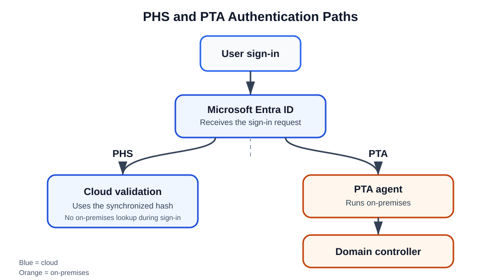

# Day 12: Microsoft Entra Seamless Single Sign-On and Hybrid Authentication

## Overview

This lesson introduces **Microsoft Entra seamless single sign-on (Seamless SSO)** and compares two ways that Microsoft Entra ID can validate passwords in a hybrid identity environment:

- **Password Hash Synchronization (PHS)**
- **Pass-Through Authentication (PTA)**

A *hybrid identity environment* connects an on-premises Windows Server Active Directory (AD) environment to Microsoft Entra ID. Seamless SSO can then let users access supported applications without repeatedly entering their credentials.

> **Key idea:** An application may be hosted on-premises on an AD server while using Seamless SSO to provide a smoother sign-in and authentication experience.



## Seamless Single Sign-On Prerequisites and Context

The environment discussed here includes:

- Windows Server on-premises
- Microsoft Entra Connect
- Seamless Single Sign-On enabled in the configuration

To determine whether Seamless SSO is enabled, check the Microsoft Entra Connect configuration.

> **Important:** This lesson describes Seamless SSO in a hybrid setup. Without an on-premises server environment, there is no on-premises Seamless SSO configuration of this kind. Environments that use Seamless SSO are therefore commonly hybrid.

### Suggested video

**Azure AD Pass-through Authentication and Seamless Single Sign-on** — Microsoft Mechanics on YouTube.

### Reference shortcuts

- `aka.ms/ptauth`
- `aka.ms/hybridsso`

## Password Hash Synchronization and Pass-Through Authentication

Think of PHS and PTA as two ways for Microsoft Entra ID—formerly called Azure AD—to verify a user's password when an organization uses both on-premises Active Directory and Microsoft Entra ID.

### Beginner-friendly analogy

Imagine that a school has a paper attendance book, representing on-premises AD, and a digital attendance application, representing Microsoft Entra ID.

### Password Hash Synchronization (PHS)

With PHS, the school copies a safe, scrambled representation of each student's password to the cloud.

When Elijah signs in:

1. Microsoft Entra ID checks the synchronized password-hash representation stored in the cloud.
2. It does not need to ask the school's on-premises server during that sign-in.
3. Sign-in remains available even if the school's server is temporarily offline, provided synchronization has already occurred.

> **Key point:** Authentication happens in the cloud.

```text
User
  |
  v
Microsoft Entra ID
  |
  v
Password verified in the cloud
```

### Pass-Through Authentication (PTA)

With PTA, the cloud does not use a synchronized password hash to authenticate the user.

When Elijah signs in:

1. Microsoft Entra ID receives the sign-in request.
2. It sends the authentication request to a PTA agent on-premises.
3. The PTA agent asks the domain controller whether the password is correct.
4. The result is returned to Microsoft Entra ID.

> **Key point:** The password is validated against on-premises Active Directory for each sign-in.

```text
User
  |
  v
Microsoft Entra ID
  |
  v
PTA Agent (on-premises)
  |
  v
Domain Controller
```

## PHS and PTA Comparison

| Feature | Password Hash Synchronization (PHS) | Pass-Through Authentication (PTA) |
|---|---|---|
| Authentication location | Cloud, in Microsoft Entra ID | On-premises AD |
| Requires on-premises systems during sign-in | No | Yes |
| Works if domain controllers are unavailable | Yes, after synchronization | No |
| Infrastructure | Simpler | Requires PTA agents |
| Performance | Generally faster | Depends partly on on-premises connectivity |
| General Microsoft guidance | Generally preferred | Used for specific requirements |

## Choosing an Authentication Method

### Choose PHS when

- You want the simplest deployment.
- You want stronger resilience and disaster-recovery capability.
- You want users to continue signing in if on-premises infrastructure fails.
- You are moving toward cloud-first identity.

Microsoft generally recommends PHS as the simplest and most resilient option.

### Choose PTA when

- Your organization requires passwords to be validated against on-premises AD at every sign-in.
- Compliance or security policy does not allow password-hash synchronization to the cloud.
- You want cloud sign-in without deploying Active Directory Federation Services (AD FS).

## Exam Tip: AZ-104 and SC-300

Remember:

- **PHS:** A password hash is synchronized to Microsoft Entra ID, and Microsoft Entra ID authenticates the user.
- **PTA:** The password is checked against the on-premises domain controller for every sign-in.

This distinction is a quick way to identify the appropriate answer in certification questions.

## Synchronization Types

Two synchronization terms to recognize are:

- **Delta sync:** Processes changes made since the previous synchronization.
- **Full sync:** Processes the complete synchronization scope rather than only recent changes.
