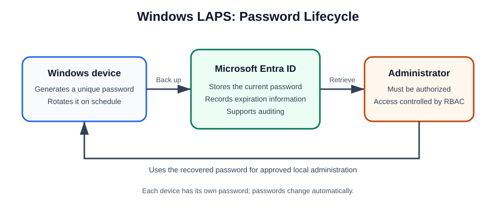

# Day 14: BitLocker and Windows LAPS

## Overview

This lesson covers two Windows security controls:

- **BitLocker** protects data by encrypting a drive.
- **Windows Local Administrator Password Solution (LAPS)** protects local administrator accounts by giving devices unique, automatically rotated passwords.

Both controls help reduce risk on managed Windows devices, but they solve different problems.

## BitLocker

BitLocker is a built-in Windows security feature that protects a computer's data by encrypting its drive. *Encryption* turns files into encoded data that only an authorized user or system can read.

### A simple analogy

Imagine that a laptop is a locked safe:

- The files are the valuable items inside the safe.
- BitLocker is the strong lock on the safe.
- The recovery key is a spare key kept in a secure place.

If someone steals the laptop and removes its drive, the data remains unreadable because it is encrypted.

### How BitLocker works

1. BitLocker encrypts the drive.
2. When Windows starts, BitLocker verifies the device.
3. If everything appears normal, Windows starts normally.
4. If BitLocker detects a suspicious change—such as a hardware, boot, or BIOS/UEFI change—it may request the 48-digit recovery key.

### Important terms

#### TPM (Trusted Platform Module)

A TPM is a security component included in many modern computers. It helps BitLocker confirm that the computer has not been tampered with before Windows starts. You can think of it as a security guard for the startup process.

#### Recovery key

A recovery key is a unique 48-digit code that can unlock a drive when BitLocker cannot verify the device.

Example format:

```text
123456-123456-123456-123456-123456-123456-123456-123456
```

> **Warning:** Always back up a real recovery key securely. The value above is only an example format.

### BitLocker compared with a Windows password

| Control | Windows password | BitLocker |
|---|---|---|
| Primary protection | Windows sign-in | Entire drive |
| If the drive is removed | Sign-in protection may be bypassed | Data remains encrypted |
| Security purpose | User authentication | Data-at-rest protection |

### Licensing

BitLocker Drive Encryption is available on:

- Windows Pro
- Windows Enterprise
- Windows Education

Windows Home typically uses the simpler **Device Encryption** feature when supported by the hardware.

### For Microsoft Entra and Microsoft 365 administrators

BitLocker recovery keys can be stored in:

- Microsoft Entra ID, formerly Azure AD
- Active Directory
- Microsoft Intune

This storage allows an authorized administrator to retrieve a recovery key when a user is locked out.

### Support and interview notes

The most common BitLocker-related support issue is a user being prompted for the recovery key after a hardware, BIOS/UEFI, or boot-configuration change.

> **Interview answer:** BitLocker is Microsoft's full-disk encryption solution for Windows. It encrypts drives and can use a TPM, PIN, startup key, and recovery key to prevent unauthorized data access if a device is lost, stolen, or tampered with.

## Windows LAPS

**LAPS** stands for **Local Administrator Password Solution**. It automatically creates, securely stores, and rotates the password of a local Administrator account on Windows devices. Instead of every computer sharing one local administrator password, each device receives a unique password.

In the Microsoft Entra scenario described here, LAPS is intended for Microsoft Entra-joined devices rather than devices that are only Microsoft Entra registered.

### A simple analogy

Imagine a school with 500 classrooms.

**Poor approach:**

- Every classroom uses the same key.
- If a student steals one key, the student can enter every classroom.

**LAPS approach:**

- Every classroom has a different key.
- The keys change automatically every few weeks.
- The principal keeps a secure record of the keys.

Windows LAPS applies the same principle to local administrator passwords.

### Why LAPS is needed

Without LAPS, several computers might share a password:

```text
PC1 -> Administrator = Welcome123
PC2 -> Administrator = Welcome123
PC3 -> Administrator = Welcome123
```

An attacker who obtains the password from one computer may be able to use it on other computers.

With LAPS, each computer has a different, periodically changed password:

```text
PC1 -> Administrator = X#4tR9!Qm2
PC2 -> Administrator = K@8Lp2$Zv1
PC3 -> Administrator = M!7Qa6#Wk5
```

> **Note:** These are illustrative examples, not passwords to use.

Unique passwords help reduce **Pass-the-Hash (PtH)** and **lateral movement** attacks. Lateral movement means an attacker uses access to one system to reach additional systems in the environment.

## Microsoft Entra LAPS Architecture



The device uses Windows LAPS to generate and rotate its local administrator password. It backs up the password to Microsoft Entra ID, where an appropriately authorized administrator can retrieve it when needed.

```text
Windows Device
      |
      v
Windows LAPS
      |
      v
Microsoft Entra ID
      |
      v
Password stored securely
      |
      v
Authorized administrator retrieves password
```

### Main features

1. **Automatic password rotation:** Passwords change automatically after a configured number of days.
2. **Secure storage:** Passwords are stored securely in Microsoft Entra ID.
3. **Password recovery:** Authorized administrators can view the current password when they need access to the machine.
4. **Auditing:** Password retrieval and updates can be audited and monitored.
5. **RBAC support:** Role-Based Access Control (RBAC) controls who can access passwords.

## Enabling LAPS in Microsoft Entra ID

### Step 1: Enable LAPS for the tenant

In the Microsoft Entra admin center, go to:

```text
Microsoft Entra admin center
    -> Devices
    -> Device settings
    -> Enable Local Administrator Password Solution (LAPS)
```

LAPS must be enabled at the tenant level before devices can back up passwords to Microsoft Entra ID.

### Step 2: Create a Windows LAPS policy

Use Microsoft Intune to create a Windows LAPS policy. This is the recommended deployment method for Microsoft Entra-joined devices.

Configure:

- Password length
- Password complexity
- Password age
- Administrator account name
- Post-authentication actions

### Step 3: Assign the policy

Assign the policy to devices or users. After the policy is applied, the process is:

```text
Device
   -> Generates password
   -> Backs up password to Microsoft Entra ID
   -> Rotates password automatically
```

## Retrieving a LAPS Password

In the Microsoft Entra admin center, go to:

```text
Microsoft Entra admin center
   -> Devices
   -> All devices
   -> Select device
   -> Local administrator password recovery
```

With the appropriate permissions, an administrator can see the current password and its expiration time.

## LAPS Compared with PIM

**Privileged Identity Management (PIM)** manages privileged identity and role activation. It is different from LAPS, which manages local administrator passwords.

| Feature | LAPS | PIM |
|---|:---:|:---:|
| Protects a local administrator account | Yes | No |
| Rotates passwords | Yes | No |
| Provides just-in-time access | No | Yes |
| Manages Microsoft Entra roles | No | Yes |
| Stores local administrator passwords | Yes | No |

PIM secures privileged identities, while LAPS secures local administrator passwords on Windows devices. They complement rather than replace each other.

## Review and Memory Aids

### Common interview question

**Question:** What problem does LAPS solve?

**Answer:** Windows LAPS protects local administrator accounts by automatically generating a unique password for each device, securely backing it up to Microsoft Entra ID or Active Directory, and rotating it regularly. This reduces the risk of Pass-the-Hash and lateral movement attacks.

### Memory aid

**LAPS = Local Admin Passwords**

Think: “LAPS keeps the local Administrator password unique, secret, and automatically changing.”
