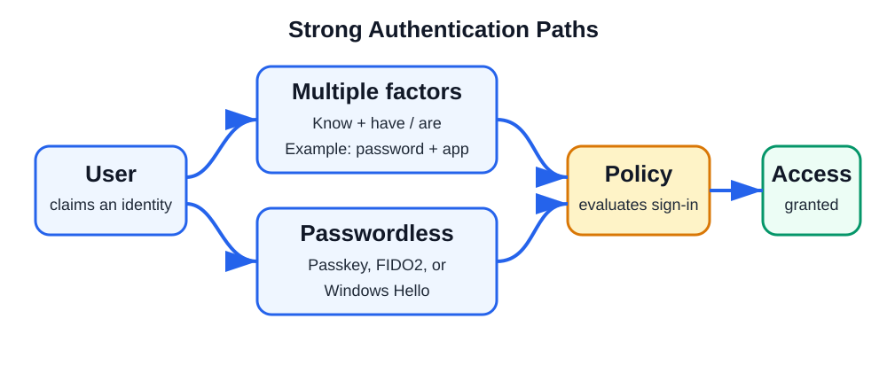

# Day 16: Strong Authentication, Passwordless Sign-In, SSO, and Identity Attacks

## Beginner-Friendly Overview

Strong authentication helps a system verify that a person is genuinely who they claim to be. This chapter introduces authentication factors, passwordless methods, Seamless Single Sign-On (SSO), common identity attacks, and a practical way to classify those attacks. It focuses on Microsoft Entra ID while also noting relevant on-premises Active Directory threats.

## Topics for the Week

- Strong Authentication 
- Entra ID Kerberos Authentication
- Global Secure Access. 

### Q&A Session

- 10:00–12:00, Tuesday–Wednesday, 13/10/2026–14/10/2026
- 10:00–16:00, Thursday, 15/10/2026

### Initial Notes

 - FIDO 2
- Passwordless (still requires a passkey)
- Certificate-based authentication
- Passkey
- Windows Hello for Business (fingerprint, face, or PIN)
- TAP (Temporary Access Pass)
- CBA (Certificate-Based Authentication)

> **Note:** Set up passwordless authentication on my tenant.

**Further reading:** spoofing, phishing, anti-spoofing, and anti-phishing.

## Strong Authentication
Strong Authentication means proving that you are really you using more than one way (or a very secure way) of verifying your identity before you can sign in.

Think of it like entering a highly secure building:
    - Weak authentication = Showing only your ID card.
    - Strong authentication = Showing your ID card and scanning your fingerprint.

Even if someone steals your ID card, they still can't get in without your fingerprint.

### The Three Authentication Factors
There are three main ways a system can verify you:

#### 1. Something You Know
This is information stored in your brain.
Examples:

- Password
- PIN
- Security-question answer
✅ You know it

#### 2. Something You Have
This is a physical device or item you possess.

Examples:

- Mobile phone
- Microsoft Authenticator app
- FIDO2 security key (YubiKey)
- Smart card
✅ You have it

#### 3. Something You Are
This is your biometric identity.
Examples:

- Fingerprint
- Face recognition (Windows Hello)
- Iris scan
✅ You are it

### What Makes Authentication "Strong"?
Strong authentication typically means using:

**Two different factors—for example:**

| Factor | Example |
|---|---|
| Something you know | Password |
| Something you have | Authenticator app |

User enters:
    Password
    Approves sign-in on phone
This is called Multi-Factor Authentication (MFA).

### Examples in Microsoft Entra ID

#### 1. Password + Microsoft Authenticator App ✅

    - User enters password.
    - User approves notification on phone.

Result:
Very difficult for attackers to compromise.

#### 2. Passkey (FIDO2 Key) ✅

    - User inserts security key.
    - Uses fingerprint or PIN.

No password needed.
This is often stronger than traditional MFA.

#### 3. Windows Hello for Business ✅

    - Device is trusted.
    - User signs in using face or fingerprint.

Strong because:
    Uses cryptographic keys.
    Bound to the device.


### What Is Not Strong Authentication?

**Password only ❌**
    Username + Password

Problem:
    Password can be guessed.
    Password can be stolen through phishing.
    Password can be reused elsewhere.

### Microsoft Entra ID and Strong Authentication
In Microsoft Entra ID, strong authentication is commonly enforced through:
    - Multi-Factor Authentication (MFA)
    - Passkeys
    - FIDO2 Security Keys
    - Windows Hello for Business
    - Certificate-Based Authentication
    - Temporary Access Pass (for onboarding)

Administrators can require strong authentication using:
    Conditional Access Policies
    Authentication Strengths

    
### Authentication Strengths (Important Exam Concept)
Microsoft introduced Authentication Strengths to define how strong a sign-in method must be.

Examples:

#### 1. MFA Strength

Allows:
    Password + Authenticator
    Password + SMS
    Password + Phone Call


#### 2. Phishing-Resistant MFA Strength
Allows only very strong methods such as:
    FIDO2 Security Keys
    Windows Hello for Business
    Certificate-Based Authentication (CBA)

These methods are much harder to steal or phish.

### Simple Real-Life Example
Imagine your bank account:

1. Weak Security
    ATM Card only

If someone steals it, they can try to use it.

2. Strong Security
    ATM Card + PIN

Now the thief needs two things.

3. Very Strong Security
    ATM Card + PIN + Fingerprint


Much harder to break.

> **One-line definition:** Strong authentication is the use of multiple verification factors, or highly secure passwordless methods, to ensure that the person signing in is genuinely who they claim to be.




## Passwordless vs. Seamless SSO
These two concepts solve different problems:
    Passwordless = How you sign in.
    Seamless SSO = How often you need to sign in.

Think of it like entering a school.

### Passwordless Authentication
What problem does it solve?
You don't need to remember or type a password.

Instead, you use:
    Fingerprint
    Face recognition
    Security key (FIDO2)
    Microsoft Authenticator phone sign-in

Example
Instead of:
    Username + Password

You use:
    Face Scan + Trusted Device

or
    Fingerprint + Security Key

Microsoft Entra Examples
    Windows Hello for Business
    FIDO2 Security Keys
    Passkeys
    Microsoft Authenticator Phone Sign-in

User Experience
    Open laptop.
    Look at camera.
    Signed in.

No password required.
 ✅ More secure
 ✅ Phishing resistant
 ✅ Better user experience

### Seamless Single Sign-On (Seamless SSO)
What problem does it solve?

You sign in once and access multiple applications without repeatedly entering credentials.

Example
You arrive at school:
    1. Security guard verifies you.
    2. You receive a badge.
    3. You can enter the library, cafeteria, and classrooms without showing ID again.

That's SSO.

In Microsoft Environments
User signs into Windows:
```text
Windows Login
      ↓
Microsoft 365
      ↓
Outlook
      ↓
Teams
      ↓
SharePoint
```

No additional sign-ins are required.

What is "Seamless" SSO?
Normally with SSO, users might still see a Microsoft sign-in page occasionally.

With Seamless SSO, the authentication happens automatically in the background for domain-joined users.

Example
User is:
    - Logged into corporate Windows PC
    - Connected to company network

User opens:
    portal.office.com

Instead of being asked:
    Enter username
    Enter password

The browser automatically signs them in.

User might not even notice authentication happened.

### Key Difference

| Passwordless | Seamless SSO |
|---|---|
| Removes passwords | Removes repeated sign-ins |
| Authentication method | Access experience |
| Focuses on security | Focuses on convenience |
| Uses biometrics, passkeys, and security keys | Uses an existing sign-in session |
| User still proves identity | User already proved identity |

### Can They Work Together?
    ✅ Yes, and this is the ideal modern setup.

Example
Morning:
    1. User signs into Windows using Windows Hello facial recognition (Passwordless).
    2. Opens Outlook, Teams, SharePoint, and OneDrive.
    3. No further login prompts (Seamless SSO).

Result:
```text
Windows Hello
        ↓
Passwordless Login
        ↓
Seamless SSO
        ↓
Outlook, Teams, SharePoint
```
The user never types a password and never signs in again during the day.

### Easy Exam/Interview Answer

**Passwordless authentication** is a sign-in method that eliminates passwords and uses stronger factors such as biometrics, passkeys, or FIDO2 keys.

**Seamless SSO** is a feature that automatically signs users into Microsoft Entra-integrated applications after they have already authenticated, reducing repeated sign-in prompts.

> **One-line memory trick:** 🗝️ Passwordless = "How do I prove who I am?" 🚪 Seamless SSO = "How many times do I need to prove it?" (Usually just once.)


## Common Identity and Authentication Attacks

If you're studying Microsoft Entra ID, Identity Protection, MFA, Conditional Access, and Authentication, these are the most common identity and authentication attacks you should know:

### Password Attacks

#### 1. Password Spray Attack
Attacker tries one common password against many accounts.

Example:
```text
User1 → Summer2025!
User2 → Summer2025!
User3 → Summer2025!
```
Why?
    Avoids account lockouts
    Very common in Microsoft 365 environments

#### 2. Brute-Force Attack
Attacker tries many passwords against a single account.

Example:
```text
Password1
Password12
Password123
Password123!
```

#### 3. Credential Stuffing
Attacker uses usernames and passwords leaked from another website.

Example:
```text
Netflix leak
→
Try same credentials on Microsoft 365
```
People reuse passwords, so this works surprisingly often.

#### 4. Dictionary Attack
Attacker uses a list of common words.
```text
welcome
admin
football
password
```

instead of random combinations.

### MFA Attacks

#### 5. MFA Fatigue Attack (Push Notification Attack)
Attacker already has the password.

They repeatedly send MFA notifications:
```text
Approve?
Approve?
Approve?
Approve?
```
Eventually the user gets tired and clicks:
    ✅ Approve

#### 6. Adversary-in-the-Middle (AiTM)
A fake login page sits between:
```text
User
 ↓
Fake Site
 ↓
Microsoft
```
User enters:
    Username
    Password
    MFA

Attacker steals the session token.
This bypasses traditional MFA.

#### 7. MFA Bombing
Another name for MFA Fatigue.
User receives hundreds of authentication requests.

Goal:
    Confuse user
    Wear down resistance

### Token and Session Attacks

#### 8. Pass-the-Token Attack
Attacker steals an authentication token.

Instead of stealing a password:
```text
Password → Not needed
Token → Stolen
```

They use the token to impersonate the user.

#### 9. Session Hijacking
Attacker steals an active browser session.

Example:
```text
User logged into Outlook
Attacker steals session cookie
Attacker becomes user
```

#### 10. Refresh Token Theft
Attacker steals a refresh token.

This can allow long-term access because new access tokens can be generated.

### Phishing Attacks

#### 11. Traditional Phishing
Fake email:
```text
Verify your mailbox immediately
```

User clicks and enters password.
Attacker captures credentials.

#### 12. Spear Phishing
Targeted phishing.

Example:
```text
Dear Elijah,
Your manager Michael shared a document...
```

More personalized and more effective.

#### 13. Business Email Compromise (BEC)
Attacker compromises an executive account.

Then sends requests like:
```text
Please transfer $10,000 urgently.
```

Very common in enterprises.

#### 14. Consent Phishing
User is tricked into granting permissions to a malicious application.

Example:
```text
Allow App to:
✓ Read Mail
✓ Read Files
✓ Access Contacts
```

User clicks "Accept".
No password theft required.

### Device Attacks

#### 15. Pass-the-Hash
Instead of using a password:
```text
Password Hash
```
is stolen and reused.

Common in on-premises Active Directory attacks.

#### 16. Credential Theft
Attackers steal:
    - Passwords
    - Browser credentials
    - Windows credentials
    - Authentication tokens

#### 17. Keylogger Attack
Malware records every key typed:
```text
Username
Password
PIN
```

and sends them to attackers.

### Identity-Based Attacks

#### 18. Account Takeover (ATO)
Any attack resulting in:
```text
Attacker becomes the user
```

This is the end goal of many attacks.

#### 19. Privilege Escalation
Attacker starts as:
```text
Normal User
```
but gains:
```text
Global Administrator
```

or another privileged role.

#### 20. Lateral Movement
After compromising one device:
```text
PC1
 ↓
PC2
 ↓
Server
 ↓
Domain Controller
```

Attacker moves across the environment.

### Cloud-Specific Microsoft Entra Attacks

#### 21. Impossible Travel

Microsoft detects:
```text
09:00 Kigali
09:30 New York
```

Not physically possible.
Often indicates compromised credentials.

#### 22. Anonymous IP Attack
Sign-in originates from:
```text
TOR
VPN
Proxy networks
```
Often considered suspicious.

#### 23. Token Replay Attack
A valid token is intercepted and reused.
```text
User Token
 ↓
Copied
 ↓
Reused by attacker
```
#### 24. OAuth App Abuse
Malicious application receives legitimate permissions.

Example:
```text
Read Mail
Read OneDrive
Read Contacts
```

User grants consent unknowingly.

### Passwordless Attacks

#### 25. Passkey Theft Attempt
Attacker attempts to steal or misuse:
    - FIDO2 credentials
    - Security keys
    - Device-bound credentials

Modern passkeys make this extremely difficult.

#### 26. SIM Swapping
Attacker convinces telecom provider to transfer the victim's phone number.

Then receives:
```text
SMS MFA Codes
```

This is why SMS MFA is less secure.

## Microsoft Identity Protection Risk Categories

These are the risks Microsoft Entra Identity Protection specifically looks for:
    1. Password Spray
    2. Credential Stuffing
    3. Anonymous IP
    4. Malware Linked IP
    5. Impossible Travel
    6. Atypical Travel
    7. Suspicious Browser
    8. Token Replay
    9. Leaked Credentials
    10. Adversary-in-the-Middle Indicators
    11. Suspicious Inbox Rules
    12. Mass Download Activity
    13. Suspicious OAuth Consent

### Easy Way to Remember for Interviews

Group attacks into 5 buckets:
```text
1. Password Attacks
   - Password Spray
   - Brute Force
   - Credential Stuffing

2. Phishing Attacks
   - Phishing
   - Spear Phishing
   - Consent Phishing
   - AiTM

3. MFA Attacks
   - MFA Fatigue
   - MFA Bombing
   - SIM Swapping

4. Token Attacks
   - Pass-the-Token
   - Token Replay
   - Session Hijacking

5. Privilege/Identity Attacks
   - Account Takeover
   - Privilege Escalation
   - Lateral Movement
```

For Entra ID interviews and certifications (SC-300, AZ-500, MS-102), the attacks you should know best are: Password Spray, Credential Stuffing, MFA Fatigue, Adversary-in-the-Middle (AiTM), Consent Phishing, Token Replay, Pass-the-Hash, Account Takeover, Privilege Escalation, and Impossible Travel.


## Broader Attack Classification

**Typosquatting** is part of a broader category of attacks that target the human user, not necessarily the authentication mechanism itself.

Think of the attack landscape like this:

### 1. Credential Attacks
Goal: Steal passwords or credentials.
    - Password Spray
    - Brute Force
    - Dictionary Attack
    - Credential Stuffing
    - Password Guessing
    - Password Cracking

Example:
```text
user@company.com
Password = Welcome123
```

### 2. Phishing and Social Engineering Attacks
Goal: Trick users into helping the attacker.

Traditional Phishing
    Fake login page.

Spear Phishing
    Targeted phishing.

Whaling
    Phishing executives and VIPs.

Smishing
    SMS phishing.

Vishing
    Voice phishing.

Business Email Compromise (BEC)
    Compromised executive account used for fraud.

Consent Phishing
    Malicious Entra/OAuth app asks for permissions.

Adversary-in-the-Middle (AiTM)
    Fake site captures authentication tokens.

QR Phishing (Quishing)
    User scans malicious QR code.

### 3. Brand Impersonation Attacks

#### A. Typosquatting

Attacker registers a lookalike domain with a spelling mistake.

Example:
```text
microsoft.com     ✅
micorsoft.com     ❌

paypal.com        ✅
paypaI.com        ❌
```

Notice the capital "I" replacing "l".

Purpose:
    Steal credentials
    Deliver malware
    Trick users

#### B. Domain Spoofing
Attacker creates:
```text
support-microsoft.com
```
to look official.

#### C. Homograph Attack
Uses similar-looking characters.

Example:
```text
microsoft.com
micrоsoft.com
```

The second "o" is actually a different Unicode character.

Looks identical to humans.

#### D. Combosquatting
Adds extra words to a trusted brand.

Examples:
```text
microsoft-login.com
microsoft-security.com
amazon-support.net
```

Very common in phishing campaigns.

### 4. MFA Attacks
MFA Fatigue
    Repeated push notifications.

MFA Bombing
    Same as MFA fatigue.

SIM Swapping
    Phone number stolen.

OTP Interception
    One-time codes intercepted.

AiTM (also fits here)
    Captures MFA sessions.

### 5. Session and Token Attacks
Session Hijacking
Cookie Theft
Pass-the-Token
Token Replay
Refresh Token Theft
Browser Session Theft

Example:
```text
Password not stolen
Token stolen
```

Attacker logs in anyway.

### 6. OAuth and Cloud App Attacks
Consent Phishing
OAuth Abuse
Malicious Enterprise Applications
Illicit Consent Grant

Example:
```text
Allow this App:
✓ Read Mail
✓ Read Files
✓ Read Contacts
```
User clicks Accept.

### 7. Active Directory Attacks
Pass-the-Hash
Kerberoasting
Golden Ticket
Silver Ticket
DCSync
NTLM Relay
Credential Dumping
Skeleton Key

These are more common in hybrid/on-prem AD environments.

### 8. Privilege Escalation Attacks
Privilege Escalation
Lateral Movement
Account Takeover
Role Abuse

Example:
```text
User
    ↓
Helpdesk Admin
    ↓
Global Admin
```

### 9. Malware-Based Credential Attacks
Keylogger
InfoStealer Malware
Remote Access Trojan (RAT)
Spyware
Credential Dumpers (Mimikatz)

### 10. Microsoft Entra Identity Protection-Focused Risks
These are risks you're most likely to encounter in SC-300/MS-102/AZ-500:

    - Password Spray
    - Leaked Credentials
    - Impossible Travel
    - Atypical Travel
    - Anonymous IP
    - Malware-Linked IP
    - Token Replay
    - Suspicious Browser
    - Adversary-in-the-Middle Indicators
    - Suspicious Inbox Rules
    - Mass Download Activity
    - OAuth Abuse
    - Consent Phishing
    - Account Takeover

### Attacks You Should Know as an Entra ID Administrator
If I were interviewing for an Entra/Identity role, I'd expect you to confidently explain:

    - Password Spray
    - Credential Stuffing
    - Phishing
    - Spear Phishing
    - Typosquatting
    - Domain Spoofing
    - Homograph Attack
    - Combosquatting
    - MFA Fatigue
    - SIM Swapping
    - Adversary-in-the-Middle (AiTM)
    - Token Replay
    - Session Hijacking
    - Consent Phishing
    - OAuth Abuse
    - Pass-the-Hash
    - Privilege Escalation
    - Lateral Movement
    - Account Takeover (ATO)
    - Impossible Travel

### Quick Memory Trick
```text
Steal Passwords
    ↓
Password Spray
Credential Stuffing

Trick Users
    ↓
Phishing
Typosquatting
Spoofing

Bypass MFA
    ↓
MFA Fatigue
SIM Swapping
AiTM

Steal Sessions
    ↓
Token Replay
Session Hijacking

Gain Control
    ↓
Privilege Escalation
Lateral Movement
Account Takeover
```

That's the mental model many identity security engineers use when classifying attacks.