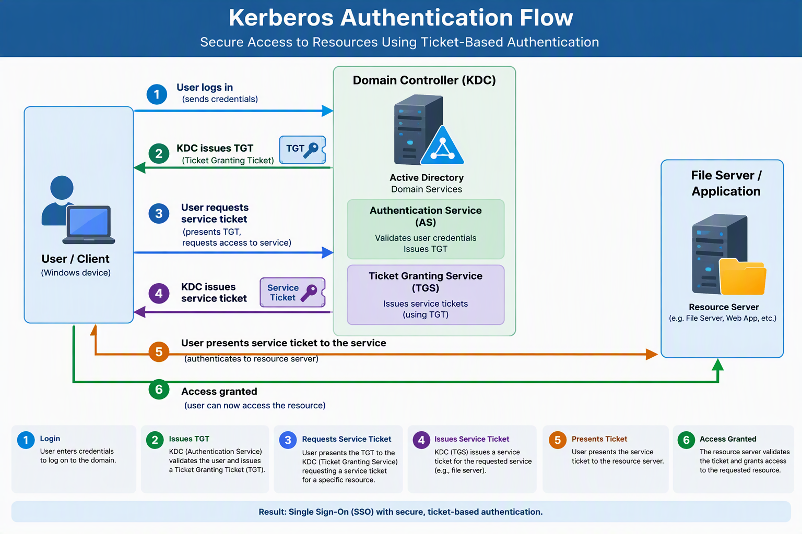
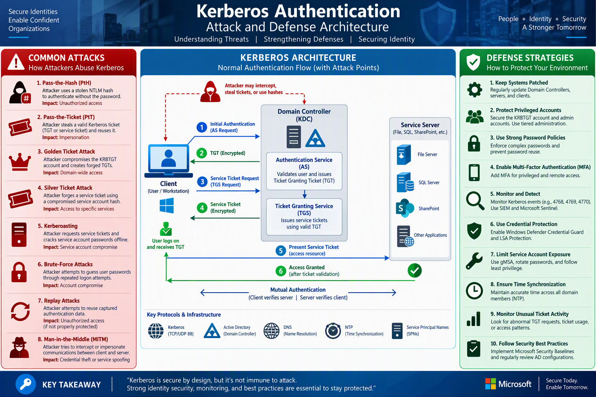

# Day 17: Kerberos Authentication

## Beginner-Friendly Overview

Kerberos is a **ticket-based authentication protocol**. A trusted service verifies a user and issues reusable tickets, allowing the user to access network services without repeatedly sending or entering a password. This chapter covers the core components and flow, Active Directory usage, troubleshooting, and common attacks.

Think of Kerberos as a highly secure way to prove who you are on a network without sending your password across the network every time.

## Hotel Access Analogy

Imagine you're staying at a hotel:

- You check in at the front desk and show your ID.
- The front desk gives you a room access card.
    - When you want to enter the gym or pool, you show the card instead of your ID again.
    - The gym trusts the card because it was issued by the hotel.

Kerberos works in a very similar way.

## Main Components
1. **Client (User/Computer)**
The person or device trying to access something.
    Example: Elijah logs into his Windows laptop.

2. **Key Distribution Center (KDC)**
The trusted "front desk."
In Active Directory, the KDC runs on the Domain Controller.
The KDC consists of:
    - Authentication Service (AS)
    - Ticket Granting Service (TGS)

3. **Service Server**
The resource you want to access.
Examples:
    - File Server
    - SQL Server
    - SharePoint
    - Print Server

## Kerberos Authentication Flow




### Step 1: User Logs In

You enter:
```text
Username: Elijah
Password: ********
```

Your computer creates a secret key based on your password.
The password itself is never sent across the network.

### Step 2: KDC Issues a Ticket Granting Ticket (TGT)
The client contacts the Authentication Service (AS).
```text
Client --> Authentication Service
"Hi, I'm Elijah"
```

The AS verifies the account and sends back a Ticket Granting Ticket (TGT).

Think of the TGT as a:
    "Master Pass"

that proves you already authenticated.
```text
Client <-- TGT
```

### Step 3: User Wants to Access a Service
Suppose you open:
```text
\\FileServer\Finance
```

The file server says:
```text
Show me proof that you are authenticated.
```

The client uses the TGT to request access.

```text
Client --> TGS
"I have a TGT. Give me a ticket for FileServer."
```

### Step 4: TGS Issues a Service Ticket
The Ticket Granting Service verifies the TGT and issues a Service Ticket.
```text
Client <-- Service Ticket
```

This ticket is specifically for:
```text
FileServer
```

It cannot be used for another service.

### Step 5: Present the Ticket
The client presents the Service Ticket to the file server.
```text
Client --> FileServer
"Here's my service ticket."
```

The server validates the ticket.

### Step 6: Access Is Granted
If the ticket is valid:
```text
FileServer --> Client
Access Granted
```

You can now open files.

## Why Kerberos Is Secure

### No Password Is Sent Over the Network

❌ Bad:
```text
Client --> Server
Password = P@ssw0rd
```

✅ Kerberos:
```text
Client --> Server
Encrypted Ticket
```
### Mutual Authentication

Not only does the server verify you, but you can also verify you're talking to the real server.
```text
User <--> Server
```
Both trust each other.

### Time-Based Tickets
Tickets expire after a certain period.

Example:
```text
TGT valid for 10 hours
```

Even if a ticket is stolen, it has a limited lifetime.

## Common Kerberos Tickets

### Ticket Granting Ticket (TGT)

Purpose:
```text
Proves your identity to the KDC
```

Used to request service tickets.
### Service Ticket (TGS Ticket)
Purpose:
```text
Used to access a specific service
```

Examples:
    - File Server
    - SQL Server
    - SharePoint

## Kerberos in Active Directory
When a user signs into a domain-joined Windows device:
```text
User
  ↓
Domain Controller (KDC)
  ↓
Obtains TGT
  ↓
Requests Service Tickets
  ↓
Accesses Network Resources
```

This is why Active Directory environments heavily rely on Kerberos.

### Simple Exam/Interview Answer
    Kerberos is a ticket-based authentication protocol used in Active Directory. It authenticates users and services through a trusted third party called the Key Distribution Center (KDC). Instead of sending passwords over the network, it uses encrypted tickets such as the Ticket Granting Ticket (TGT) and Service Tickets, providing secure and mutual authentication.

### Easy Way to Remember
```text
Login
  ↓
Get TGT
  ↓
Request Service Ticket
  ↓
Access Service
```

**TGT = Master Pass**
 Service Ticket = Access Pass to a specific resource

That's Kerberos in its simplest form. For your Entra ID / Active Directory support role, remember the key phrase:
    "Kerberos is a ticket-based authentication protocol that uses a KDC, TGT, and Service Tickets to securely authenticate users without transmitting passwords across the network."


## Presentation on Kerberos Authentication
[Presentation on Kerberos Authentication](assets/Kerberos_Authentication_presentation.pptx)

### Slide 1: What Is Kerberos Authentication?

**Key Message**
Kerberos is a secure, ticket-based authentication protocol used by Active Directory to verify identities without repeatedly sending passwords across the network.

**Content**
    - Developed to provide secure network authentication
    - Default authentication protocol for Active Directory
    - Uses encrypted tickets instead of passwords
    - Enables Single Sign-On (SSO)

**Visual**
    Modern security-themed image
    User → Domain Controller → Application diagram

**Real-World Analogy**

"Think of Kerberos like receiving a visitor badge at reception. Once verified, you use the badge to access different rooms without repeatedly showing your ID."

### Slide 2: Kerberos Components and Architecture
**Key Components**
    - Client/User
    - Key Distribution Center (KDC)
    - Authentication Service (AS)
    - Ticket Granting Service (TGS)
    - Application/Resource Server

**Simplified Explanation**
    - KDC lives on the Domain Controller.
    - AS verifies identity.
    - TGS issues access tickets.
    - Resource Server validates tickets.

Visual
Create a clear architecture diagram:
```text
+---------+
|  Client |
+---------+
     |
     v
+------------------+
| Domain Controller|
|       KDC        |
|  AS + TGS        |
+------------------+
     |
     v
+------------------+
| Resource Server  |
+------------------+
```

### Slide 3: How Kerberos Works
**Authentication Flow**
    - User signs in.
    - Client requests a Ticket Granting Ticket (TGT).
    - KDC validates credentials.
    - KDC issues TGT.
    - Client requests Service Ticket.
    - TGS validates TGT.
    - Service Ticket issued.
    - Client accesses application.
    - Access granted.

Key Point
✅ Password is only used during the initial sign-in process.

Visual
A numbered workflow with arrows showing the ticket flow.

### Slide 4: Security Benefits and Single Sign-On
**Benefits**
🔒 Passwords are not repeatedly transmitted
🔒 Mutual Authentication
    Client validates server
    Server validates client
🔒 Single Sign-On (SSO)
    Authenticate once
    Access multiple resources
🔒 Strong Encryption
🔒 Reduced Risk of Credential Theft

Visual
Shield infographic showing:
    - SSO
    - Encryption
    - Identity Protection
    - Access Control

### Slide 5: Troubleshooting, Best Practices, and Summary
**Common Issues**
| Issue | Cause |
|---|---|
| Clock skew | Time mismatch |
| DNS errors | Name-resolution problems |
| SPN issues | Incorrect Service Principal Names |
| Ticket expired | TGT timeout |
| Trust failures | AD relationship issue |

**Useful Commands**
```powershell
klist
setspn -L <account>
nltest /dsgetdc:<domain>
w32tm /query /status
```

**Best Practices**
    Keep time synchronized
    Maintain healthy DNS
    Use AES encryption
    Monitor authentication logs
    Minimize NTLM usage

**Key Takeaway**
    Kerberos provides secure, ticket-based authentication, enables Single Sign-On, and is the preferred authentication protocol in Active Directory environments.

**Visual**
    Summary infographic showing: User → KDC → Ticket → Resource → Access Granted


## Important Kerberos-related Security Concepts
These are some of the most important Kerberos-related security concepts that every Active Directory or Entra ID support engineer should understand.

### 1. Pass-the-Ticket (PtT) Attack

**What is it?**

A Pass-the-Ticket attack occurs when an attacker steals a valid Kerberos ticket from a user's machine and reuses it to impersonate that user.

The attacker doesn't need the password.

They only need the ticket.

Normal Authentication
```text
User
  |
  |-- Gets TGT
  |
  |-- Gets Service Ticket
  |
  |-- Accesses File Server
```

During a Pass-the-Ticket Attack
```text
Attacker
   |
   |-- Steals Kerberos Ticket
   |
   |-- Injects Ticket into Memory
   |
   |-- Authenticates as Victim
```

Real Example
Suppose:
```text
User: FinanceAdmin
```
logs into a shared server.

An attacker gains local admin access and extracts Kerberos tickets from memory using tools like Mimikatz.

The attacker can now present that ticket to:
```text
File Server
SQL Server
SharePoint
```
and be treated as:
```text
FinanceAdmin
```

without knowing the password.

Why It's Dangerous
    - No password cracking required
    - Can bypass MFA if ticket already exists
    - Difficult to detect
    - Can lead to lateral movement

Prevention
✅ Credential Guard
✅ Tiered administration
✅ Limit privileged logons
✅ Patch systems regularly
✅ Monitor unusual Kerberos ticket activity

### 2. Golden Ticket Attack

**What is it?**
A Golden Ticket attack is one of the most powerful Active Directory attacks.
An attacker forges their own Ticket Granting Ticket (TGT).
Instead of stealing a ticket, they create one.

Why "Golden"?
Because the attacker can generate tickets for:
```text
ANY USER
ANY GROUP
ANY COMPUTER
```

including:
```text
Domain Admin
Enterprise Admin
Administrator
```

**How It Works**
The attacker steals the:
```text
KRBTGT account hash
```

The KRBTGT account is the special account used by the KDC to sign Kerberos tickets.
```text
Domain Controller
      |
      | Uses
      |
   KRBTGT
```

Attack Flow
```text
Attacker
   |
   |-- Gets KRBTGT hash
   |
   |-- Creates Fake TGT
   |
   |-- Claims to be Domain Admin
   |
   |-- Accesses Everything
```

**Why It Is So Dangerous**
Because the Domain Controller trusts tickets signed with the KRBTGT secret.
To the DC, the fake ticket looks legitimate.

**Signs of a Golden Ticket**
    - Unusual ticket lifetimes
    - Nonexistent usernames appearing authenticated
    - Domain Admin activity from unexpected machines
    - Kerberos activity without corresponding logon events

**Prevention**
- ✅ Protect Domain Controllers
- ✅ Use Privileged Access Workstations (PAWs)
- ✅ Monitor KRBTGT account exposure
- ✅ Rotate the KRBTGT password twice after compromise

**Easy Interview Answer**
    A Golden Ticket attack occurs when an attacker compromises the KRBTGT account hash and forges Kerberos Ticket Granting Tickets, allowing them to impersonate any user in the domain and gain persistent administrative access.

### 3. Sloppy Service Accounts
**What Are Service Accounts?**

Service accounts run applications and services.

Examples:
```text
SQL Service
IIS Application Pool
Backup Software
Azure AD Connect
```

Sloppy Service Account Example
```text
Account: svc-sql
Password: Welcome123
```

Problems:
- ❌ Never expires
- ❌ Domain Admin rights
- ❌ Interactive logon allowed
- ❌ Password unchanged for years

Why Attackers Love Them

Service accounts often have:
    - High privileges
    - Weak passwords
    - SPNs configured
    - Rarely monitored

Kerberoasting Connection
An attacker can request a service ticket:
```text
TGS Request
```

for a service account.

Part of the ticket is encrypted using the service account password hash.

The attacker can then try to crack it offline.

This attack is called:
```text
Kerberoasting
```

Prevention
- ✅ Use gMSA (Group Managed Service Accounts)
- ✅ Long random passwords
- ✅ Least privilege
- ✅ Deny interactive logon
- ✅ Regular audits

**Easy Way to Remember**
    Service accounts often become "forgotten administrator accounts" that attackers abuse for persistence and privilege escalation.

### 4. Clock Drift Breaks Authentication

**What is clock drift?**

Clock drift means devices have different system times.

Example:
```text
Client: 10:00 AM
DC:     10:12 AM
```

The clocks are 12 minutes apart.

**Why Does Kerberos Care?**
Kerberos uses timestamps to prevent replay attacks.

Each authentication request contains a time value.
```text
Client
  |
  | Timestamp = 10:00
  |
  v
KDC
```

If the timestamp differs too much, Kerberos assumes the request may be malicious.

**Default Kerberos Tolerance**
Windows allows approximately:
```text
5 minutes
```
difference between systems.

**What Happens If Time Is Wrong?**
You may see errors such as:
```text
KRB_AP_ERR_SKEW
```

Meaning:
```text
Clock Skew Too Great
```

Authentication fails.

**Real Support Scenario**
```text
User cannot access file shares
```

You verify:
```text
Client Time = 09:45
Domain Controller = 10:02
```

Difference:
```text
17 minutes
```

Result:
```text
Kerberos Failure
```

**How to Fix**

Check time synchronization:
```powershell
w32tm /query /status
```

Resync time:
```powershell
w32tm /resync
```
Verify the domain hierarchy is providing correct time.

**Why This Exists**
Without timestamp validation, an attacker could capture an authentication request and replay it later.

Kerberos uses synchronized clocks to help prevent these replay attacks.

### Quick Summary
**Pass-the-Ticket**
    Steal an existing Kerberos ticket and reuse it.

**Golden Ticket**
    Steal the KRBTGT hash and forge your own TGT for any user.

**Sloppy Service Accounts**
    Poorly secured service accounts become easy targets for Kerberoasting and privilege escalation.

**Clock Drift**
    Kerberos relies on accurate time. More than about 5 minutes of skew can cause authentication failures.

> **Exam tip:** Remember this progression:
Remember this progression:
```text
Weak Service Account
        ↓
Kerberoasting
        ↓
Privilege Escalation
        ↓
KRBTGT Compromise
        ↓
Golden Ticket
        ↓
Full Domain Compromise
```

This attack chain is one of the classic Active Directory compromise paths that Microsoft identity engineers and security teams watch for.


## Where Kerberos Is Most Commonly Used
Kerberos is traditionally an on-premises authentication protocol, but it is also used in some cloud and hybrid scenarios.

### 1. On-Premises Active Directory (Most Common)
Kerberos is the default authentication protocol in Microsoft Active Directory domains.

Examples:
    - Windows sign-in
    - File servers
    - Print servers
    - SQL Server
    - SharePoint Server
    - IIS web applications
    - Domain-joined computers

```text
User PC
   |
   | Kerberos
   v
Domain Controller (KDC)
   |
   +--> File Server
   +--> SQL Server
   +--> Print Server
```

This is where Kerberos was originally designed to operate.

### 2. Hybrid Environments
Many organizations today use a combination of:
```text
On-Prem Active Directory
        +
Microsoft Entra ID
```

Examples:
    - User signs into a domain-joined laptop.
    - Kerberos authenticates the user to the on-prem AD.
    - Entra ID provides access to Microsoft 365 services.
```text
Laptop
   |
   +--> Kerberos --> Active Directory
   |
   +--> Entra ID --> M365 Apps
```
In many companies, both technologies coexist.

### 3. Cloud Scenarios
Kerberos is not the primary authentication method for most cloud applications.

Cloud services typically use:
    - OAuth 2.0
    - OpenID Connect (OIDC)
    - SAML

Examples:
```text
Microsoft 365
Salesforce
ServiceNow
Google Workspace
```

These generally do not use Kerberos directly for authentication.

### 4. Azure and Microsoft Entra Kerberos
Microsoft has extended Kerberos into some cloud scenarios.
Examples include:

Azure Files
Users can access Azure file shares using Kerberos authentication.
```text
Windows Client
      |
      | Kerberos
      |
Azure Files
```

**Windows Hello for Business (Hybrid)**
    Can leverage Kerberos for accessing on-prem resources after cloud authentication.

**Microsoft Entra Kerberos**
    Used to help users access traditional Windows resources from cloud-managed environments.

### Easy Comparison
| Environment | Kerberos Used? |
|---|---|
| Active Directory Domain | ✅ Yes |
| File Servers | ✅ Yes |
| SQL Server | ✅ Yes |
| SharePoint Server (On-Prem) | ✅ Yes |
| Microsoft 365 | ❌ Usually No |
| Entra ID Sign-in | ❌ Usually No |
| Azure Files | ✅ Yes |
| Hybrid AD + Entra | ✅ Yes |

### Real-Life Example
Suppose you work at a bank:

**On-Prem**
You sign into your Windows laptop.
```text
Username + Password
        ↓
Active Directory
        ↓
Kerberos TGT
```

You then access:
```text
\\FinanceServer
SQL Database
Internal HR Website
```
using Kerberos.

**Cloud**
When you open:
```text
https://outlook.office.com
https://portal.office.com
```

authentication is typically handled through Microsoft Entra ID, using modern protocols like OAuth and OpenID Connect rather than Kerberos.

**Support Engineer Interview Answer**
    Kerberos is primarily an on-premises authentication protocol used by Active Directory to provide secure ticket-based authentication for Windows domains, file servers, databases, and internal applications. While modern cloud services such as Microsoft 365 mainly use OAuth, OpenID Connect, and SAML, Kerberos is still used in hybrid environments and certain cloud services such as Azure Files and Microsoft Entra Kerberos integrations.


## Real-World Kerberos Examples
A great real-world example is Microsoft Active Directory.

### A Large Company Using Active Directory
Imagine a company like Microsoft, a bank, a university, or a government agency with:
    - 50,000 employees
    - Thousands of Windows computers
    - Hundreds of file servers
    - SQL databases
    - SharePoint sites
    - Printers and internal applications

When an employee logs into their domain-joined Windows laptop:
```text
Username: elijah@company.com
Password: ********
```

The Domain Controller uses Kerberos to authenticate the user.

#### What Happens Behind the Scenes?

    1. User signs into Windows.
    2. Domain Controller issues a TGT (Ticket Granting Ticket).
    3. User opens a file share:

```text
\\FinanceServer\Reports
```

    1. Kerberos requests a Service Ticket.
    2. File server validates the ticket.
    3. Access is granted without asking for the password again.

```text
Windows Laptop
      |
      | Kerberos
      |
Domain Controller
      |
      | Service Ticket
      |
File Server
```

This is called Single Sign-On (SSO).

The user authenticates once and can access multiple resources seamlessly.

### University Example

Consider a university:
```text
Student Portal
Library System
Email
Computer Labs
Wi-Fi
```

A student logs in once using their university credentials.

Kerberos enables access to all these systems without repeatedly entering a password.

### Banking Example
Banks commonly use Kerberos within their internal Active Directory environments for:
    - Employee workstations
    - Core banking applications
    - Database servers
    - File servers
    - Internal web applications

The reason is that Kerberos provides:
 - ✅ Mutual authentication
 - ✅ Ticket-based access
 - ✅ Strong encryption
 - ✅ Centralized identity management

### Government Example
Many government networks use:
```text
Active Directory + Kerberos
```

to control access to:
    - Citizen databases
    - Internal portals
    - Secure document repositories
    - Administrative systems

Because passwords are not continuously transmitted across the network, Kerberos offers a more secure authentication model.

**Everyday Example You Can Relate To**

At work, if you:

    1. Sign into your Windows device.
    2. Open a file share.
    3. Connect to a SQL server.
    4. Access SharePoint.
    5. Use an internal web app.

and you're not prompted for your password each time, there is a very good chance Kerberos is being used behind the scenes (assuming the systems are domain-joined and configured for Kerberos).

**Interview Answer**
    A common real-life implementation of Kerberos is Microsoft Active Directory. Organizations such as enterprises, banks, universities, healthcare institutions, and government agencies use Kerberos to provide secure Single Sign-On (SSO), allowing users to authenticate once and access multiple network resources through Kerberos tickets rather than repeatedly sending passwords.


## Kerberos Attack-and-Defense Architecture Diagram
