# Microsoft Global Secure Access (GSA) & Entra Private Access
## Beginner-Friendly Architecture Guide

**Audience:** Beginners, Helpdesk Engineers, Identity Administrators, Security Engineers, Architects

---
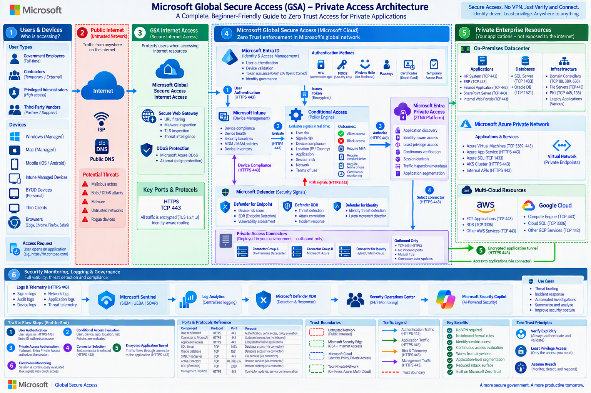


# 1. What is Microsoft Global Secure Access (GSA)?

Microsoft Global Secure Access (GSA) is Microsoft's Security Service Edge (SSE) platform designed to provide secure access to applications, resources, and the internet using Zero Trust principles.

Think of GSA as a modern replacement for many traditional VPN-based access solutions.

Instead of trusting users because they are connected to a company network, GSA continuously verifies:

- Who the user is
- What device they are using
- Whether the device is healthy
- Where the user is connecting from
- What application is being accessed
- The current security risk level

## Traditional VPN vs GSA

### Traditional VPN

- Connect user directly to corporate network
- Broad network access
- Larger attack surface
- Implicit trust model

### Microsoft GSA

- Connect user only to approved application
- No full network access
- Smaller attack surface
- Zero Trust model

---

# 2. What is Zero Trust?

Zero Trust follows one simple philosophy:

> Never Trust, Always Verify.

## Three Core Principles

### Verify Explicitly

Always verify:

- User identity
- Device health
- Location
- Session risk

### Use Least Privilege Access

Users only receive the minimum access they need.

### Assume Breach

Design security assuming attackers may already be present.

---

# 3. Components of Microsoft Global Secure Access

Microsoft GSA has three major pillars.

## Internet Access

Protects access to public internet resources.

Examples:

- Microsoft 365
- SaaS Applications
- Public websites

## Private Access

Provides secure access to private applications.

Examples:

- Internal HR portals
- Databases
- ERP systems
- Finance applications

## Security Service Edge (SSE)

Combines:

- Identity
- Network security
- Conditional access
- Traffic inspection

---

# 4. What is Microsoft Entra Private Access?

Microsoft Entra Private Access is Microsoft's Zero Trust Network Access (ZTNA) solution.

It allows users to access private applications securely without traditional VPNs.

## What Problems Does It Solve?

### Problem

Traditional VPN:

User → VPN → Entire Corporate Network

### Solution

Entra Private Access:

User → Approved Application Only

Result:

- Better security
- Less lateral movement
- Reduced attack surface

---

# 5. Understanding Key Terminologies

## Identity

A digital representation of a user.

Examples:

- Elijah@company.com
- Administrator accounts
- Service accounts

## Authentication

Proving who you are.

Examples:

- Password
- MFA
- Passkey
- FIDO2 Key

## Authorization

Determines what you can access.

Authentication = Who are you?

Authorization = What can you access?

## MFA

Multi-Factor Authentication requires two or more verification methods.

Examples:

- Password + Authenticator App
- Password + FIDO2 Key

## Conditional Access

Microsoft's policy engine.

Examples:

- Block risky login
- Require MFA
- Require compliant device

## Device Compliance

Determines whether a device meets company requirements.

Examples:

- Disk encryption enabled
- Antivirus installed
- Device managed by Intune

## Session

A temporary authenticated connection between user and application.

## Least Privilege

Only necessary permissions are granted.

## ZTNA

Zero Trust Network Access.

Application-based access instead of network-based access.

---

# 6. Architecture Overview

## High-Level Architecture

```text
USER
 |
 v
DEVICE
 |
 v
INTERNET
 |
 v
GLOBAL SECURE ACCESS
 |
 v
ENTRA ID
 |
 v
CONDITIONAL ACCESS
 |
 v
ENTRA PRIVATE ACCESS
 |
 v
PRIVATE ACCESS CONNECTOR
 |
 v
INTERNAL APPLICATION
```

---

# 7. Trust Boundaries Explained

## Trust Boundary #1

Public Internet

Anything outside company control.

Examples:

- Home Networks
- Public Wi-Fi
- ISP Networks

## Trust Boundary #2

Microsoft Security Edge

Location where Microsoft evaluates identity and risk.

## Trust Boundary #3

Zero Trust Control Plane

Contains:

- Entra ID
- Conditional Access
- Risk Evaluation

## Trust Boundary #4

Private Enterprise Resources

Contains:

- Internal Applications
- Databases
- Domain Controllers

---

# 8. Detailed Authentication Flow

## Step 1 - User Initiates Access

User opens application.

Example:

- HR Portal
- Finance Application

## Step 2 - Request Sent to Microsoft Edge

Traffic reaches Global Secure Access.

## Step 3 - Authentication

Entra ID verifies identity.

Checks:

- Username
- Password
- MFA

## Step 4 - Risk Analysis

Conditional Access evaluates:

- User Risk
- Device Risk
- Location
- Session Risk

## Step 5 - Policy Decision

Possible outcomes:

- Allow
- Block
- Require MFA
- Require Compliant Device

## Step 6 - Private Access Decision

Authorized traffic moves to Private Access.

## Step 7 - Connector Selection

Nearest connector selected.

## Step 8 - Secure Tunnel Creation

Encrypted tunnel established.

## Step 9 - Application Access

User reaches approved application.

## Step 10 - Continuous Verification

Access continuously monitored.

---

# 9. Understanding Private Access Connectors

Connectors are lightweight services installed near applications.

Examples:

- Datacenter
- Azure VNet
- AWS
- GCP

## Important Security Benefit

Connectors make outbound connections only.

```text
Connector --> Microsoft Cloud
```

No inbound firewall exposure required.

---

# 10. Microsoft Components Explained

## Microsoft Entra ID

Provides:

- Authentication
- Identity Management
- Single Sign-On

## Microsoft Intune

Provides:

- Device Management
- Compliance Checks
- Security Baselines

## Microsoft Defender for Endpoint

Provides:

- Endpoint Detection and Response
- Vulnerability Assessment
- Device Risk Signals

## Microsoft Defender for Identity

Provides:

- Identity Attack Detection
- Lateral Movement Detection

## Microsoft Defender XDR

Provides:

- Cross-domain threat correlation
- Incident investigation

## Microsoft Sentinel

Provides:

- SIEM
- SOAR
- Threat Hunting

---

# 11. Traffic Flow Types

## Blue Traffic

Authentication Traffic.

Example:

User → Entra ID

## Green Traffic

Authorized Application Traffic.

Example:

User → Application

## Orange Traffic

Security Telemetry.

Example:

Defender → Sentinel

## Purple Traffic

Management Traffic.

Example:

Administrator → Configuration Portal

---

# 12. Security Benefits of GSA Private Access

## No VPN Required

Users do not need traditional VPNs.

## Reduced Attack Surface

Applications remain private.

## Identity-Based Security

Access decisions are based on identity.

## Continuous Access Evaluation

Risk changes are evaluated in real time.

## Application Segmentation

Users access only specific applications.

## Better User Experience

Faster and simpler connectivity.

---

# 13. Real-World Example

Scenario:

A finance employee works from home.

Flow:

1. User signs into Entra ID
2. MFA challenge completed
3. Intune confirms compliance
4. Conditional Access evaluates risk
5. Private Access authorizes request
6. Connector establishes encrypted tunnel
7. User accesses Finance Application
8. Defender monitors activity
9. Sentinel collects logs
10. Security team gains visibility

---

# 14. Common Interview Questions

## What is Global Secure Access?

Microsoft's Security Service Edge platform.

## What is Entra Private Access?

Microsoft's ZTNA solution for private applications.

## What replaces traditional VPN?

Microsoft Entra Private Access.

## What is Conditional Access?

Policy engine that evaluates access conditions.

## What is the role of Intune?

Checks device compliance and device trust.

## What is the role of Defender?

Provides threat and risk signals.

## What is the role of Sentinel?

Centralized security monitoring and response.

---

# 15. Beginner Summary

Global Secure Access is Microsoft's modern Zero Trust platform.

At its core:

- Entra ID verifies identity
- MFA strengthens authentication
- Intune validates devices
- Conditional Access evaluates risk
- Private Access replaces VPNs
- Connectors securely reach applications
- Defender provides security signals
- Sentinel provides monitoring and response

The result is secure application access without exposing the corporate network.

---
---
---
---
---
---
---


# Microsoft Global Secure Access (GSA) Private Access
## Expanded Version 2 Deep-Dive Guide
### Architecture, Authentication, Packet Flows, Protocols, Connectors, Trust Boundaries & Troubleshooting

**Audience:** Beginner → Intermediate → Technical Support Engineer → Security Engineer

---
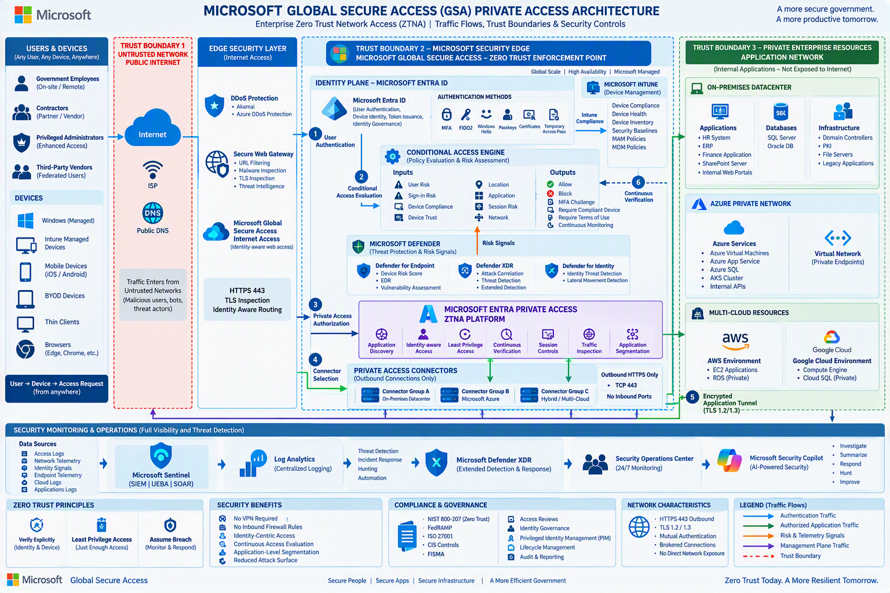


# 1. What Is Microsoft Global Secure Access?

Microsoft Global Secure Access (GSA) is Microsoft's Security Service Edge (SSE) platform that provides:

- Microsoft Entra Private Access (ZTNA)
- Microsoft Entra Internet Access (SWG)
- Identity-centric access control
- Continuous Access Evaluation
- Application-level segmentation
- VPN replacement capabilities

Instead of:

```text
User
    ↓
VPN Tunnel
    ↓
Entire Network
```

GSA works like:

```text
User
   ↓
Identity Verification
   ↓
Policy Validation
   ↓
Specific Application
```

The user never receives network-level access.

---

# 2. Complete High-Level Architecture

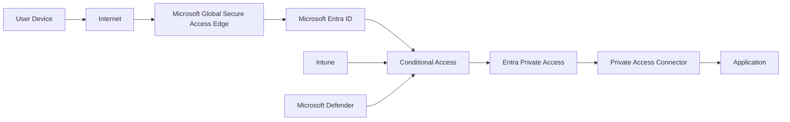

---

# 3. Trust Boundaries

## Trust Boundary 1

```text
UNTRUSTED INTERNET
```

Contains:
- Home WiFi
- Public WiFi
- Hotels
- Airports
- Unknown Networks

## Trust Boundary 2

```text
Microsoft Security Edge
```

Contains:
- Authentication
- Policy Enforcement
- Risk Evaluation
- Traffic Inspection

## Trust Boundary 3

```text
Private Resources
```

Contains:
```text
Azure
AWS
On-Prem
GCP
```

---

# 4. Packet Flow Walkthrough

Example:

```text
User = Elijah
Application = HR Portal
URL = https://hr.contoso.com
```

## DNS Resolution

Protocol:

```text
DNS
UDP 53
TCP 53
```

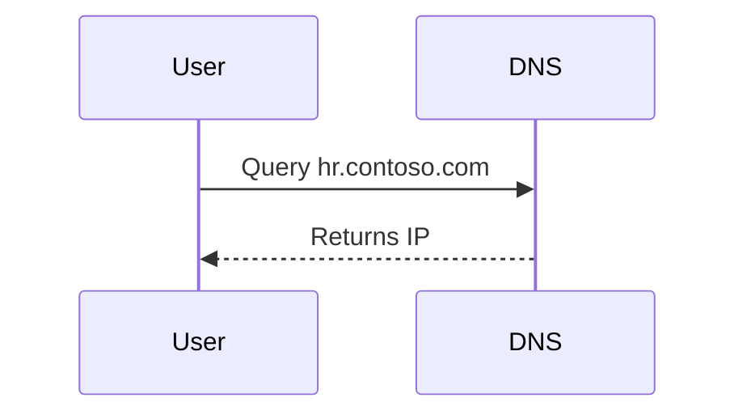

## TLS Handshake

```text
TCP 443
HTTPS
TLS 1.2 / TLS 1.3
```

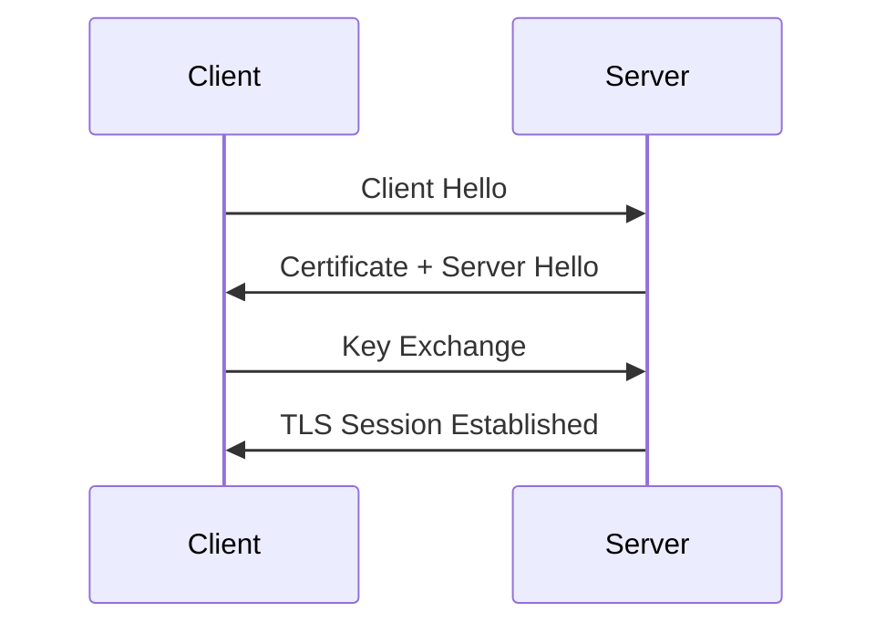

---

# 5. Authentication Flow

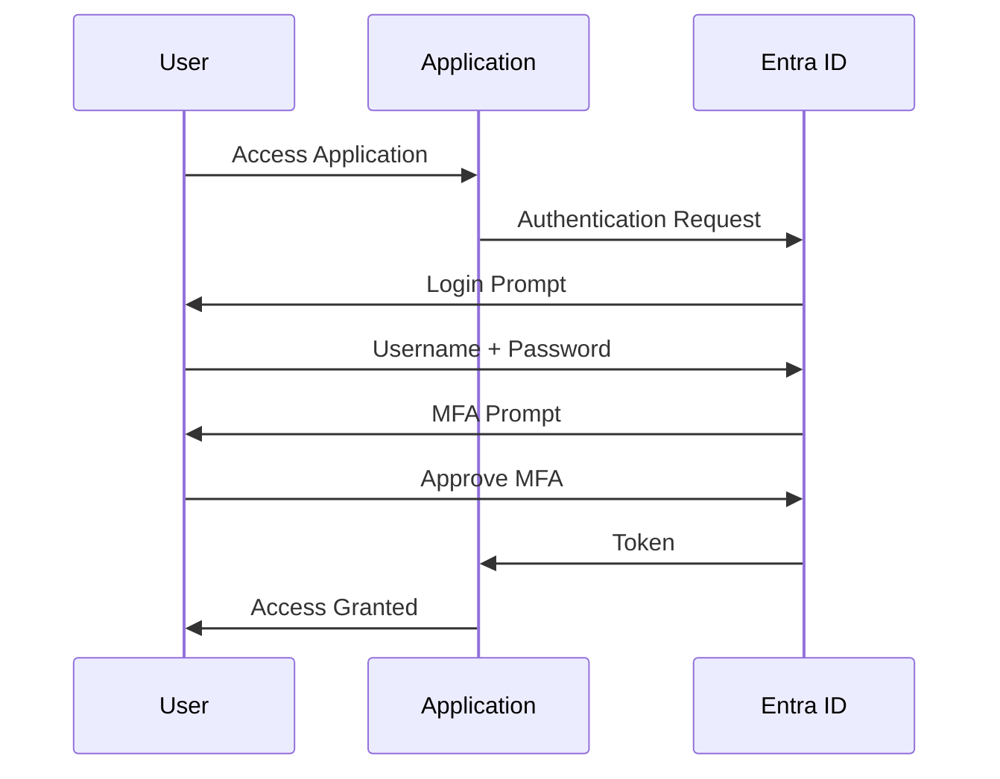

---

# 6. OAuth Tokens

## ID Token

Purpose:

```text
Who are you?
```

## Access Token

Purpose:

```text
What are you allowed to do?
```

## Refresh Token

Purpose:

```text
Get new Access Tokens without signing in again.
```

---

# 7. Multi-Factor Authentication

Methods:

- Microsoft Authenticator
- FIDO2
- Passkeys
- Windows Hello for Business
- Certificate Authentication
- SMS
- Voice

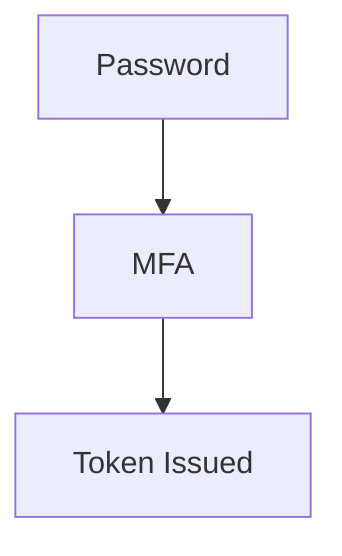

---

# 8. Conditional Access Evaluation

Signals:

### User Signals
- User Risk
- Identity Risk
- Privileged User

### Device Signals
- Compliant
- Non-Compliant
- Managed
- Unmanaged

### Network Signals
- Location
- IP Address
- ASN
- Anonymous Proxy

### Defender Signals
- Malware Detection
- Endpoint Risk
- Identity Risk

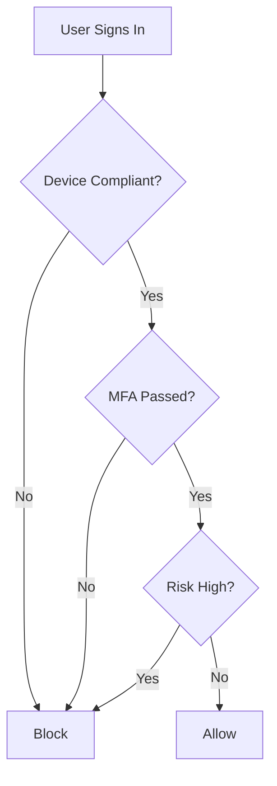

---

# 9. Continuous Access Evaluation (CAE)

Checks continuously:

- User disabled
- Password change
- Location change
- Risk elevation
- Session compromise

---

# 10. Microsoft Defender Integration

### Defender for Endpoint
- Device Risk
- EDR
- Vulnerability Assessment

### Defender for Identity
- Golden Ticket Detection
- Pass-the-Hash Detection
- Kerberos Threat Detection

### Defender XDR
- Attack Correlation
- Threat Investigation
- Cross-domain Detection

---

# 11. Private Access Connector Deep Dive

Connector locations:

- On-Premises
- Azure
- AWS
- Google Cloud

Security model:

```text
Outbound TCP 443 Only
No Inbound Ports
```

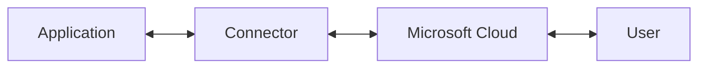

---

# 12. Packet Journey

### Authentication
```text
HTTPS TCP 443
```

### Authorization
```text
HTTPS TCP 443
```

### Application Tunnel
```text
HTTPS TCP 443
```

### Connector to Application
```text
Web App = TCP 443
SQL = TCP 1433
RDP = TCP 3389
SSH = TCP 22
Oracle = TCP 1521
```

---

# 13. Kerberos Flow

```text
AS-REQ
AS-REP
TGS-REQ
TGS-REP
AP-REQ
AP-REP
```

Ports:

```text
TCP/UDP 88
```

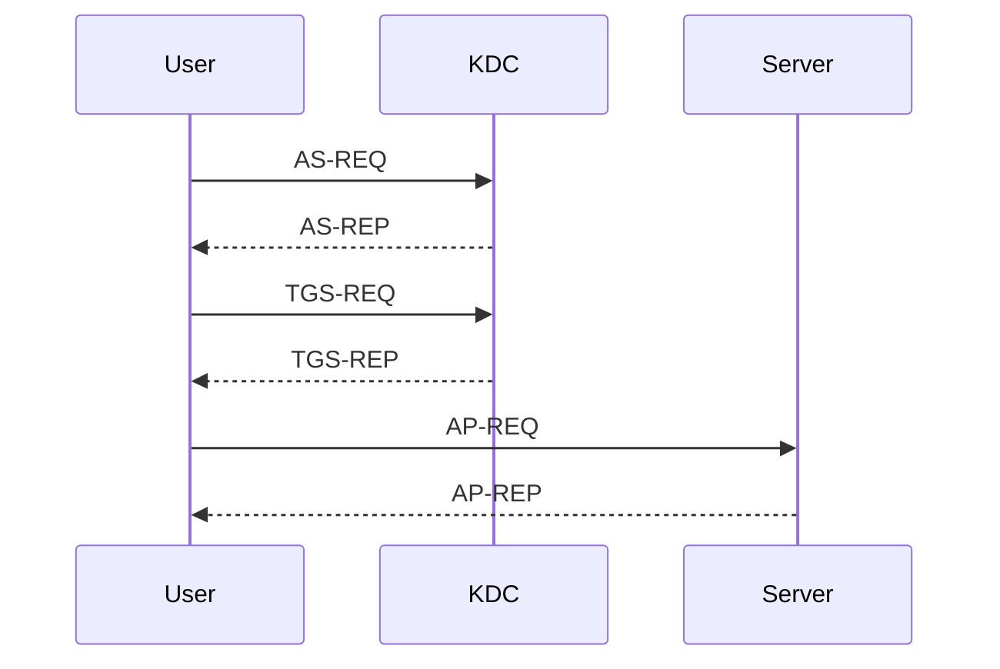

---

# 14. Common Enterprise Ports

```text
HTTPS                TCP 443
HTTP                 TCP 80
DNS                  UDP/TCP 53
LDAP                 TCP 389
LDAPS                TCP 636
Kerberos             TCP/UDP 88
SMB                  TCP 445
SQL Server           TCP 1433
Oracle               TCP 1521
SSH                  TCP 22
RDP                  TCP 3389
WinRM                TCP 5985
WinRM HTTPS          TCP 5986
NTP                  UDP 123
Syslog               UDP 514
```

---

# 15. Security Monitoring Architecture

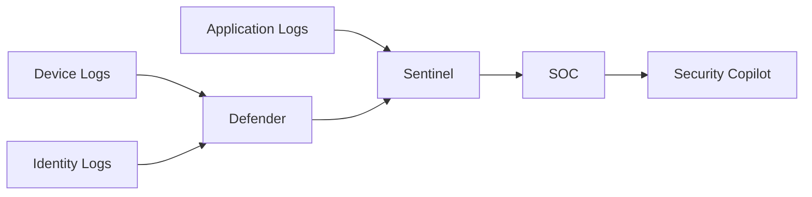

---

# 16. Attack Surface Reduction

Traditional VPN:

```text
User gains Network Access
```

Private Access:

```text
User gains Application Access Only
```

Benefits:

- No inbound access
- Application segmentation
- Least privilege
- Identity verification

---

# 17. End-to-End Transaction Flow

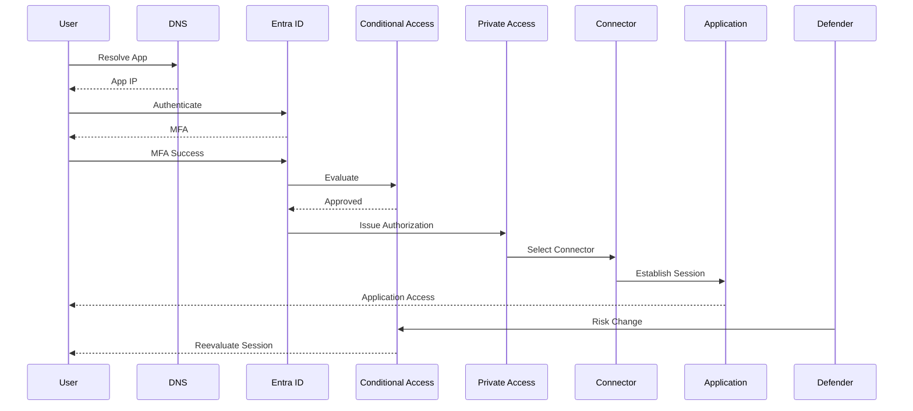

---

# 18. Troubleshooting Flow For Engineers

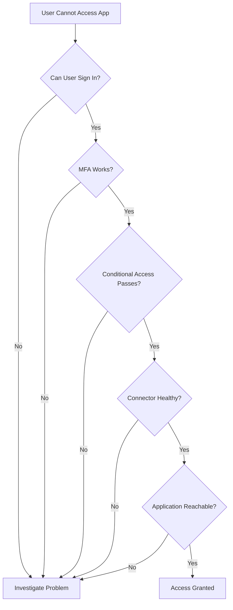

---

# Final Summary

Microsoft Global Secure Access Private Access combines:

```text
Identity + Device Trust + Risk Evaluation
+ Application-Level Access
+ Continuous Verification
```

Zero Trust Principle:

```text
Trust Nothing
Verify Everything
Continuously
```
