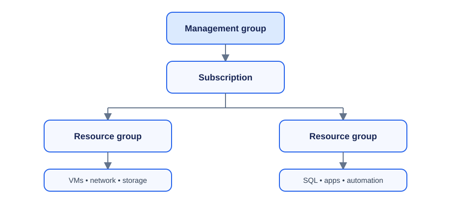

# Day 1: Cloud Computing and Azure Fundamentals

## Overview

This lesson introduces cloud computing, its cost and deployment models, Azure's global infrastructure, availability choices, and the Azure resource hierarchy. For a beginner, the main idea is that cloud providers supply computing resources on demand while the customer chooses how much control, responsibility, resilience, and cost they need.

## Course and support context

- **SCIM:** Azure Identity (Authentication).
- **Team:** Account Management and Synchronization.
- **ASC:** Azure Support Center, which provides tools for troubleshooting customer issues from DFM.

## What is cloud computing?

Cloud computing provides technology services over a network, including:

- **Compute:** Linux servers, virtual machines, and web applications.
- **Storage:** Files and databases.
- **Networking:** Secure connections between a cloud provider and an organization.
- **Analytics:** Visualization of telemetry and performance data.

Major cloud providers include Microsoft, Amazon, and Google. Cloud consumption commonly follows **PAYG (pay as you go)**.

### Key cloud concepts

| Concept | Meaning |
|---|---|
| High availability | Keeping services available as much as possible. Availability is not literally 100%, but services may target very high percentages such as 99.9999%. |
| Scalability | Expanding or shrinking capacity when needed. |
| Global reach | Making services accessible to users in different parts of the world. |
| Agility | Adapting and delivering resources quickly. |
| Disaster recovery | Recovering data and services after unforeseen events. |
| Fault tolerance | Continuing service by failing over to another system or datacenter when a component fails. |
| Elasticity | Automatically or rapidly growing and reducing capacity with demand. |
| Customer latency capabilities | Placing and designing services to provide acceptable response times for customers. |
| Predictive cost considerations | Estimating and planning expected cloud spending. |
| Security | Protecting identities, data, applications, and infrastructure. |

## Subscriptions and licenses

A **subscription** is a plan, service agreement, billing boundary, or resource container that an organization purchases. An Azure subscription enables the creation of resources in the Azure portal. A subscription:

- Defines the available services and features.
- Can contain multiple licenses or services.
- May be purchased in quantities.
- In Microsoft 365, includes plans such as Microsoft 365 E3, Business Premium, or Dynamics 365 Sales.

A **license** is a right assigned to a user or device to use a product or service. It:

- Grants access to included services and features.
- Consumes one seat from the purchased quantity.
- Can be assigned, for example, as an E3 license to Elijah or a Business Premium license to another user.

> **In one sentence:** A subscription is what the organization buys; a license is what is assigned to a user or device so that they can use the subscription's services.

## Cloud economics

### Economies of scale

**Economies of scale** means reducing costs and improving efficiency by operating at a much larger scale than a small organization could. Cloud providers are very large businesses and can leverage that scale.

### Capital expenditure and operational expenditure

| Capital expenditure (CapEx) | Operational expenditure (OpEx) |
|---|---|
| Spend on physical infrastructure up front. | Spend on services or products as needed. |
| High up-front cost. | No up-front infrastructure cost; pay as you use. |
| The investment's value reduces over time. | Billing occurs as consumption happens. |
| The expense may be deducted from tax bills over the applicable period. | The expense may be deducted in the same year, subject to applicable tax rules. |

### Consumption-based model

- No up-front infrastructure cost.
- No need to purchase and manage costly infrastructure.
- Pay for additional resources when they are needed.
- Stop paying for resources that are no longer needed.

## Cloud deployment models

### Public cloud

- Owned and managed by a third-party provider.
- Resources are shared among multiple customers over secure network connections, typically the internet.
- No capital expenditure is required to scale up.
- Applications can be provisioned and deprovisioned quickly.
- Organizations pay only for the resources and services they use.

Examples include Microsoft Azure, AWS, and Google Cloud.

### Private cloud

- Dedicated to one organization.
- Can be hosted on-premises or by a service provider.
- Provides greater control, security, and customization.
- The organization has complete control over resources, security, and compliance.

### Hybrid cloud

- Combines public and private cloud environments.
- Allows data and applications to move between environments.
- Provides flexibility and scalability while preserving control over security, compliance, and legal requirements.
- Lets an organization choose where applications and workloads run.

## Cloud service models and shared responsibility

The **shared responsibility model** explains which security and management duties belong to the customer and which belong to the cloud provider.

| Model | Customer manages | Cloud provider manages |
|---|---|---|
| On-premises/private cloud | Data and access, applications, runtime, operating system, virtual machines, compute, networking, and storage | Nothing in this simplified model |
| Infrastructure as a Service (IaaS) | Data and access, applications, runtime, operating system, and virtual machines | Compute, networking, and storage |
| Platform as a Service (PaaS) | Data and access, and applications | Runtime, operating system, virtual machines, compute, networking, and storage |
| Software as a Service (SaaS) | Data, users, and access permissions | Applications, runtime, operating system, virtual machines, compute, networking, and storage |

> **Memory aid:** On-premises means you manage everything. With IaaS, you manage the OS, applications, and data. With PaaS, you manage applications and data. With SaaS, you mainly manage data and access.

## Azure global infrastructure

### Regions

An Azure **region** is a collection of datacenters in a specific geographic area.

- Regions provide flexibility and scalability.
- They help preserve data-residency requirements within geographic boundaries.
- A region close to users can reduce latency and improve performance.
- Not every service is available in every region.
- Some services are global and do not depend on one region.
- Azure has more than 60 regions supporting customers in more than 140 countries.

When selecting a region, balance performance, service availability, compliance, and cost.

### Region pairs

- Each Azure region is paired with another region.
- Azure prefers at least 300 miles of separation between datacenters in a regional pair.
- Some services replicate automatically to the paired region.
- During a broad outage, recovery of one region in each pair is prioritized.
- Azure platform updates are rolled out to paired regions sequentially rather than simultaneously.
- Paired regions are normally in the same geography, with Brazil as an exception.

| Region | Paired region |
|---|---|
| North Central US | South Central US |
| East US | West US |
| West US 2 | West Central US |
| US East 2 | Central US |
| Canada Central | Canada East |
| North Europe | West Europe |
| UK West | UK South |
| Germany Central | Germany Northeast |
| Southeast Asia | East Asia |
| East China | North China |
| Japan East | Japan West |
| Australia Southeast | Australia East |
| India South | India Central |
| Brazil South (primary) | South Central US |

Region pairs support geographic isolation, disaster recovery, sequential updates, prioritized recovery, replication for supported services, and business continuity.

### Geographies

An Azure **geography** is a discrete market boundary designed around data residency, sovereignty, compliance, and regulation. It is larger than a region and usually contains two or more regions.

Geography categories include:

- Americas
- Europe
- Asia Pacific
- Middle East
- Africa

Customers can deploy within a geography to keep data and applications near users and meet local requirements. Region pairs usually remain within the same geography, with limited exceptions such as Brazil South.

## Availability and disaster recovery

| Option | Stated VM SLA | Protection and use |
|---|---:|---|
| Single VM with Premium Storage | 99.9% | Simplest deployment for basic or lift-and-shift workloads; limited protection from hardware or datacenter failure. |
| Availability set | 99.95% | Spreads VMs across fault and update domains within a datacenter. |
| Availability zones | 99.99% | Uses physically separate datacenters in one region to protect against a datacenter failure. |
| Region pairs | Not represented by one VM SLA here | Supports multi-region disaster recovery, replication, failover, and regional protection. |

The protection hierarchy is:

1. **Single VM:** Basic availability for an individual workload.
2. **Availability set:** Protection from server and maintenance failures inside a datacenter.
3. **Availability zones:** Protection from a complete datacenter failure inside a region.
4. **Region pairs:** Protection and recovery planning for a regional outage.

### Availability sets

An availability set keeps an application online during planned maintenance and unexpected hardware failures.

- **Update domains (UDs)** separate VMs for scheduled maintenance. Updates are applied sequentially so that every VM is not restarted at once.
- **Fault domains (FDs)** separate VMs across hardware that does not share the same power and network resources. A rack failure in one domain should not affect VMs in another.

Placing two or more VMs in an availability set distributes them across UDs and FDs, improving resilience within a single Azure datacenter.

## Azure resource organization



The hierarchy is:

1. **Management groups:** Governance across multiple subscriptions.
2. **Subscriptions:** Logical containers for billing and Azure resources.
3. **Resource groups:** Containers for related resources.
4. **Resources:** Individual services such as VMs, SQL databases, storage accounts, networking components, and automation services.

### Resource groups

- A resource group is a logical container for resources that often share a lifecycle.
- Every Azure resource belongs to one—and only one—resource group at a time.
- RBAC can be applied at the resource-group or individual-resource level.
- Resource groups simplify deployment, management, monitoring, and deletion.

Two valid organizational patterns are:

- **One resource group:** Web, database, VM, and storage are managed together.
- **Multiple resource groups:** Web/database, VM, and storage resources are separated according to management needs.

## Least privilege and RBAC

The **principle of least privilege (LPR)** says to grant only the minimum access required for a job. For example, a Help Desk agent may reset passwords but cannot create Global Administrators.

**Role-Based Access Control (RBAC)** is a method for assigning permissions through roles. Users receive roles, and roles contain defined permissions, such as Global Administrator, User Administrator, Helpdesk Administrator, or Billing Administrator.

> **Relationship:** Least privilege is the security principle—"grant only what is needed." RBAC is one mechanism used to implement that principle.

RBAC assignments can be temporary or permanent depending on the supporting access-management process; RBAC itself is the role-based authorization model.

## Azure Resource Manager

**Azure Resource Manager (ARM)** is the management layer used to create, update, configure, organize, and delete Azure resources and resource groups. It also supports:

- Access control.
- Consistent deployment and configuration.
- Resource lifecycle management.
- Automation through templates, APIs, Azure CLI, PowerShell, and SDKs.

```text
Management group
├── Subscription
│   ├── Resource group
│   │   ├── Virtual machine
│   │   ├── Networking resources
│   │   └── Storage resources
│   └── Resource group
│       └── SQL database
└── Subscription
    └── Resource group
        ├── Compute resources
        └── Automation resources
```
