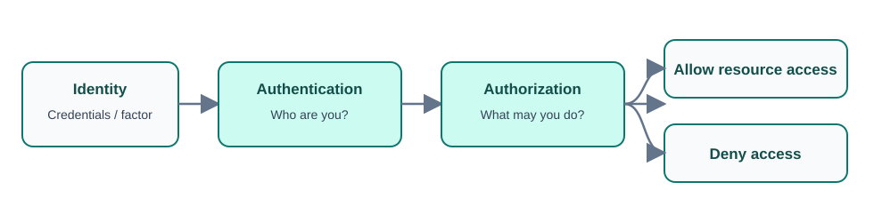

# Day 2: Identity, Security, Governance, and Compliance

## Overview

This lesson connects identity concepts—authentication, authorization, MFA, and Microsoft Entra ID—to Azure security, governance, monitoring, compliance, and Microsoft 365 licensing. Beginners should first remember the sequence: prove who you are, determine what you may do, apply the minimum required access, and continuously monitor and protect the environment.

## Authentication and authorization

Two concepts are fundamental to identity and access:

- **Authentication (AuthN):** "Who are you?" It identifies the person or service requesting access and validates credentials.
- **Authorization (AuthZ):** "What can you access or do?" It determines the authenticated identity's permissions.

> **Important:** Authentication happens first; authorization follows.



### Beginner examples

At a treehouse, giving the secret password proves that you are a friend (**authentication**). Once inside, rules may let you play games and read comics but prevent you from using the toolbox (**authorization**).

Other authentication examples include entering a password, unlocking a phone with a fingerprint, or showing a school ID. Authorization examples include:

- A student can view grades but cannot change them.
- A teacher can view and update grades.
- A player can use a game but cannot alter its code.

At a library, showing a library card authenticates you; the membership rules authorize which books you may borrow. Authentication gets you in, while authorization determines what you can do after entry.

## Microsoft Entra ID

**Microsoft Entra ID**, formerly Azure Active Directory (Azure AD), is Microsoft's cloud identity and access-management service. It supports:

- Employee authentication.
- Single sign-on (SSO).
- Application management.
- Business-to-business (B2B) guest access.
- Business-to-customer (B2C) identity services.
- Device management.
- Passwordless and additional authentication methods such as SMS, voice calls, passkeys, Microsoft Authenticator, and other authenticator applications.

### Beginner-friendly model

Think of Entra ID as a digital school office:

1. It checks who you are.
2. It determines which rooms or resources you may enter.
3. SSO lets one identity access multiple applications without repeated sign-ins.
4. Application management controls who can use each app.
5. B2B gives selected access to trusted partners, suppliers, or consultants using their existing identities.
6. B2C manages customer sign-ins. For example, a third-party application such as Monet may allow a Tek email identity to sign in rather than requiring a separate Monet account.
7. Device management records and protects approved laptops and phones; access can be blocked if a device is lost.

| Concept | Simple question |
|---|---|
| Authentication | Who are you? |
| Authorization | What can you do? |
| SSO | Can one sign-in reach many apps? |
| Application management | Who can use which app? |
| B2B | Which trusted external guests may enter? |
| B2C | How do customers sign in? |
| Device management | Which company devices are known and protected? |

## Multi-factor authentication

**Multi-factor authentication (MFA)** requires two or more different categories of evidence:

| Factor | Meaning | Examples |
|---|---|---|
| Something you know | Knowledge held in your head | Password, PIN, security answer |
| Something you possess | An item you control | Mobile phone, security token, smart card, USB security key |
| Something you are | A biometric characteristic | Fingerprint, facial recognition, iris scan |

A typical Microsoft 365 sign-in could be:

1. Enter `user@example.com` and a password.
2. Approve a notification on a phone.
3. Access is granted only after both checks succeed.

For a child-friendly analogy, a clubhouse might require both a secret password and a special badge. A stolen password alone is no longer enough.

## Security monitoring and incident response

### Azure Security Center

Azure Security Center is described in these notes as a monitoring service providing threat protection for Azure and on-premises services. It:

- Makes recommendations from configurations, resources, and networks.
- Monitors security settings across cloud and on-premises workloads.
- Applies security policies to newly provisioned services.

For a beginner, imagine a security guard, detective, and adviser that watches computers, servers, applications, and networks; reports unlocked doors; and recommends stronger protection.

> **Terminology note:** Product names can change over time. “Azure Security Center” is the name used in these course notes.

### Incident-response usage

The recorded incident stages are:

1. **Detect:** Notice a suspicious sign-in or another problem.
2. **Assess:** Determine seriousness and affected systems.
3. **Diagnose:** Analyze logs and find the cause.
4. **Stabilize:** Stop further impact, for example by disabling a compromised account or blocking an attacker.
5. **Close:** Resolve the incident, document lessons learned, and improve controls.

Security Center can be used particularly in the Detect, Assess, and Diagnose stages. Recommendations may include enabling MFA, updating software, correcting settings, and strengthening passwords.

## Azure Information Protection and information controls

**Azure Information Protection (AIP)** classifies and protects documents and emails with labels:

- Automatically, using administrator-defined rules and conditions.
- Manually, when users choose labels.
- Through a combination of automatic and manual labeling guided by recommendations.

AIP works with Azure resources, Security & Compliance experiences where labels apply to email, and Exchange email services.

### PowerShell commands

```powershell
Install-Module -Name AIPService
Enable-AipService
```

Types of labels include:

- Sensitivity labels.
- Retention labels.

Rules include:

- **Transport/mail-flow rules:** Created by administrators and applied during mail transport.
- **Inbox rules:** Created by users in their inboxes.

## Azure Advanced Threat Protection

**Azure Advanced Threat Protection (Azure ATP)** is described as a cloud security solution for identifying, detecting, and investigating advanced threats, compromised identities, and malicious insider actions.

- It provides a dedicated portal for monitoring and response.
- Sensors are installed on domain controllers.
- The cloud service runs on Azure infrastructure.

In a school analogy, sensors are cameras or motion detectors, the portal is the control room, and the Azure cloud is the remote security headquarters. Sensors watch for unusual logins, stolen credentials, hacked accounts, and suspicious attempts to reach company data. Investigators can determine who acted, when, and which systems were visited.

## Microsoft 365 license families

The following is a consolidated view of major Microsoft 365 license families recorded for 2026. Licensing changes regularly, so current commercial terms should be checked before a purchase.

### Personal and family

| License | Intended for | Key features |
|---|---|---|
| Microsoft 365 Personal | Individual users | Office apps, 1 TB OneDrive, Outlook, and Copilot benefits |
| Microsoft 365 Family | Households of up to six users | Personal benefits for multiple users |

### Business, up to 300 users

| License | Desktop apps | Email | Security | Best for |
|---|---:|---:|---|---|
| Business Basic | No; web only | Yes | Basic | Browser-based small businesses |
| Apps for Business | Yes | No | Basic | Organizations using third-party email |
| Business Standard | Yes | Yes | Basic | Growing businesses |
| Business Premium | Yes | Yes | Advanced | Device and security management |

### Enterprise

| License | Desktop apps | Windows Enterprise | Security | Best for |
|---|---:|---:|---|---|
| Office 365 E1 | Web only | No | Basic | Large organizations |
| Office 365 E3 | Yes | No | Moderate | Enterprise productivity |
| Office 365 E5 | Yes | No | Advanced | Security- and compliance-heavy organizations |
| Microsoft 365 E3 | Yes | Yes | Advanced | Most enterprise users |
| Microsoft 365 E5 | Yes | Yes | Highest | Enterprise security, compliance, and analytics |
| Microsoft 365 Apps for Enterprise | Yes | No | Basic | Desktop apps only |

### Frontline, education, and government

| Family | Licenses |
|---|---|
| Frontline | Microsoft 365 F1 for kiosk/shared-device users; Office 365 F3 for web/mobile productivity; Microsoft 365 F3 adds security and device management |
| Education | Office 365 A1/A3/A5; Microsoft 365 A1 for Devices; Microsoft 365 A3/A5 |
| US Government | Microsoft 365 GCC, GCC High, and DoD; Office 365 GCC, GCC High, and DoD |

### Common add-ons and standalone plans

- Microsoft Copilot for Microsoft 365
- Teams Phone
- Power BI Pro and Power BI Premium Per User
- Microsoft Entra ID P1 and P2
- Microsoft Defender for Endpoint P2
- Microsoft Defender for Office 365 P2
- Microsoft Purview compliance add-ons
- Exchange Online Plan 1/2
- SharePoint Online Plan 1/2
- OneDrive for Business Plan 1/2
- Visio Plan 1/2
- Project Plan 1/3/5

```text
Personal / Family
├── Business
│   ├── Business Basic
│   ├── Apps for Business
│   ├── Business Standard
│   └── Business Premium
├── Frontline
│   ├── F1
│   └── F3
├── Enterprise
│   ├── E1
│   ├── E3
│   └── E5
└── Education
    ├── A1
    ├── A3
    └── A5
```

Memory aid:

- Basic = online Office.
- Standard = full Office apps.
- Premium = Standard plus security.
- E1 = enterprise online.
- E3 = enterprise professional.
- E5 = enterprise premium security.
- F1/F3 = frontline workers.
- A1/A3/A5 = education.

These families are useful for tenant administration and certification preparation such as SC-900, MS-900, and AZ-500.

## Azure Policy and initiatives

**Azure Policy** evaluates resources against organizational rules and service-level agreements. Built-in definitions and initiatives cover categories such as storage, networking, compute, Security Center, and monitoring.

The implementation flow is:

1. Create a policy definition describing what to evaluate and which effect to apply.
2. Assign the definition to a scope containing resources.
3. Review compliant and non-compliant evaluation results.

The notes record that the system reviews policy every hour. A walkthrough should demonstrate definition, assignment, and result review.

A **policy initiative** groups multiple policy definitions and assigns them as one unit. For example, an initiative could combine requirements for antivirus on VMs, MFA, storage encryption, and security monitoring. An initiative definition groups the rules; an initiative assignment applies that group to a scope. This reduces repeated assignments and enables higher-level compliance tracking, such as monitoring Security Center recommendations.

## Role-Based Access Control

**Role-Based Access Control (RBAC)** provides fine-grained access management. It separates duties and gives users only the access needed for their work.

- Identities come from Entra ID: users, applications, and groups.
- Roles are assigned at scopes such as management group, subscription, resource group, and resource.
- The assignment determines who can perform which actions on which resources.

### Beginner example

In a school, students, teachers, librarians, and the principal receive different permissions. In Azure:

- Developer Tom may create VMs and restart servers but cannot delete the subscription or change billing.
- Finance user Sarah may view costs and invoices but cannot create servers or modify applications.

This applies the **principle of least privilege**: give each person only the keys needed for their job.

The same idea appears in a game server: a Builder can construct objects, a Moderator can remove disruptive players, and the Server Owner can change everything.

> **Memory aid:** RBAC = right people + right access + right resources. It answers “who can do what” in Azure.

## Resource locks and blueprints

### Resource locks

| Lock | Read | Update | Delete |
|---|---:|---:|---:|
| `CanNotDelete` | Yes | Yes | No |
| `ReadOnly` | Yes | No | No |

Locks protect against accidental modification or deletion. They can be managed at subscription, resource-group, or resource scope. `ReadOnly` is more restrictive because it blocks both updates and deletion.

### Azure Blueprints

Azure Blueprints create reusable environment definitions that recreate Azure resources and apply policies:

- They help audit and trace deployments.
- Built-in tools and artifacts help maintain compliance.
- Blueprints can be associated with Azure DevOps build artifacts and release pipelines for tracking.

## Subscription governance and work tickets

Three important subscription-governance considerations are:

- **Billing:** Reports and chargeback can be generated by subscription.
- **Access control:** A subscription is a deployment boundary where RBAC can be applied.
- **Subscription limits:** Some limits are hard limits. Additional subscriptions may be required when a hard limit cannot be raised.

Tickets identified for work:

- MFA.
- Conditional Access (C/A) policies.
- Global access control.
- Device management.
- Active Directory Federation Services (ADFS).

## Tags

Tags are name-value metadata that organize Azure resources and support billing rollups.

```yaml
resource-1:
  owner: joe
  department: marketing
  environment: production

resource-2:
  cost-center: marketing
```

## Azure monitoring and service health

### Azure Monitor

Azure Monitor collects, analyzes, and acts on telemetry from cloud and on-premises environments to improve application availability and performance.

- Collection starts when a subscription and resources exist.
- Activity Logs record resource creation and modification.
- Metrics measure resource performance and consumption.
- An Azure Monitor agent can collect operational data from a resource.

Monitoring can:

- **Analyze:** Use Azure Monitor experiences for containers, VMs, and other resources, plus Application Insights for applications.
- **Respond:** Use alerts for critical conditions and autoscale with Azure Monitor metrics.
- **Visualize:** Build charts, tables, and interactive Power BI views.
- **Integrate:** Connect monitoring data to other systems and custom solutions.

### Azure Service Health

Azure Service Health provides personalized issue impact, guidance, notifications, and resolution updates:

1. **Azure Status:** A global overview of Azure service health.
2. **Service Health:** A customizable dashboard for services in the regions an organization uses.
3. **Azure Resource Health:** Diagnosis and support for issues affecting specific resources.

## Compliance, privacy, and trust

Microsoft provides cloud certifications and attestations that help organizations address legal, regulatory, security, and privacy requirements.

| Offering | Meaning |
|---|---|
| CJIS | Criminal Justice Information Services |
| HIPAA | Health Insurance Portability and Accountability Act |
| CSA STAR | Cloud Security Alliance Security, Trust, Assurance, and Risk Certification |
| ISO/IEC 27018 | International standard for protecting personally identifiable information in public clouds |
| GDPR | European Union data privacy and protection regulation |
| NIST | Standards and frameworks for cybersecurity and risk management |

### Microsoft Privacy Statement

The statement explains:

- What data Microsoft processes.
- How Microsoft processes it.
- The purposes for which it is used.

Its purpose is openness about how personal and organizational data is collected, handled, protected, and used.

### Trust Center

The Trust Center provides security, privacy, compliance, policy, feature, and practice information. It includes expert resources organized by topic and by role for business managers, administrators, engineers, risk assessors, privacy officers, and legal teams.

### Service Trust Portal and Compliance Manager

The **Service Trust Portal (STP)** is a companion site for cloud-compliance publications. It provides:

- Audit reports.
- Regulatory-compliance guides.
- Trust and data-protection publications.

It hosts **Compliance Manager**, a workflow-based risk-assessment tool that:

- Assigns, tracks, and verifies assessment activities.
- Calculates a score from compliance status.
- Stores compliance artifacts in a secure repository.
- Tracks assessments, remediation, evidence, and audit preparation.

> **Note:** It is not possible to fulfill every recommendation in every environment; recommendations must be evaluated in context.

### Azure Government

Azure Government is a separate Azure environment for US federal, state, and local governments and approved solution providers.

- It is physically isolated from non-US government deployments.
- Access is limited to screened, authorized personnel.
- Referenced standards include FedRAMP, NIST SP 800-171, ITAR, IRS 1075, DoD Impact Levels 2/4/5, and CJIS.

## Further reading: information protection and exposure management

### IRM

**Information Rights Management (IRM)** controls what recipients can do with files and email. Like a lent notebook that may be read but not copied, printed, or shared, an HR email could be restricted from forwarding.

### AIP and sensitivity labels

AIP classifies and protects information. A finance spreadsheet labeled **Confidential – Finance Team Only** can be encrypted so that outsiders cannot read it. The notes identify Microsoft 365 E5 as a license containing AIP capabilities.

Sensitivity labels act like security stickers. A `Confidential` label can encrypt a document, restrict sharing, or add a watermark.

### Transport rules and SITs

A transport rule can automatically act on email. For example, a message containing a credit-card number can receive a Confidential label without sender action.

A **Sensitive Information Type (SIT)** identifies patterns such as credit-card, passport, national-ID, bank-account, and phone numbers. Policies can then protect matching data.

### MSEM

**Microsoft Security Exposure Management (MSEM)** identifies and prioritizes weak points such as devices missing updates, risky user permissions, and critical vulnerabilities. It helps a security team decide which high-risk problems to fix first.

### Microsoft Secure Score

Microsoft Secure Score is a security-improvement score in Microsoft Defender. Completing recommended actions—such as enabling MFA, protecting admin accounts, and configuring email protection—can raise a score, for example from 45% to 82%. It is a progress indicator and security “report card,” not a guarantee of security.

| Term | Simple meaning | Example |
|---|---|---|
| IRM | Controls permitted use of files/email | An HR email cannot be forwarded |
| AIP | Classifies and protects information | A finance file is Confidential |
| Sensitivity label | Security sticker for data | A document is labeled Internal |
| Transport rule | Automatic mail action | Label email containing card data |
| SIT | Sensitive-pattern detector | Find passport or card numbers |
| MSEM | Finds and prioritizes weak spots | Identify vulnerable devices |
| Secure Score | Security progress score | Improve after completing controls |

### Topics named for additional study

- IRM
- AIP and its licensing
- Sensitivity labels
- Transport rules for label application
- SITs
- MSEM
- Microsoft Secure Score in Microsoft Defender
