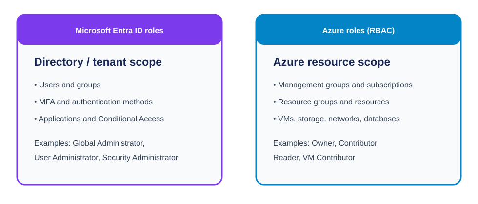

# Day 3: Microsoft Entra Groups, Roles, and Domain Protection

## Overview

This lesson covers how to identify a hybrid tenant, use Microsoft Entra groups, and distinguish directory roles from Azure resource roles. It ends with domain-email protections. The essential beginner distinction is that Entra roles manage identities and directory settings, while Azure RBAC roles manage Azure resources.

## Tenant and synchronization checks

To switch directly to a tenant, use:

```text
https://portal.azure.com/<tenant-ID>
```

In the **Users** area, check **On-premises sync enabled**:

- **Yes:** The user or environment is hybrid.
- **No:** The user or environment is cloud-only/online.

## Sharing posture

- **Least permissive:** Files can be shared only with users inside the environment.
- **Most permissive:** The broadest sharing configuration permitted by the organization's settings.

> **Caution:** Choose sharing settings according to business and security requirements; broader sharing increases exposure.

## Group types and licensing

The notes focus on three group categories in Azure/Microsoft Entra:

- Microsoft 365 groups.
- Security groups.
- Distribution groups.

**Security groups** can be used for group-based licensing. When a new user is added to a licensed security group, the user inherits that license.

> **Important:** When a license is inherited from a group, it cannot be directly managed on the individual user as though it were a direct assignment.

To remove a group-inherited license:

1. Remove the user from the group; or
2. Remove the license assignment from the group.

Being an administrator does not automatically make someone a member of a group.

### Membership types

- Assigned.
- Dynamic user.
- Dynamic device.

Microsoft Entra roles can be assigned to a group by enabling **Microsoft Entra roles can be assigned to the group**. When set to **Yes**, the group is limited to assigned membership and cannot be dynamic; membership rules cannot be created. When set to **No**, other membership-type options remain available.

## PIM and administrative units

- **PIM:** Privileged Identity Management. PIM helps govern privileged access, including time-limited role activation.
- **Administrative units:** Containers used to scope administrative control to part of an organization.

## Entra roles, Azure roles, and the old Azure AD name

Microsoft renamed Azure Active Directory to Microsoft Entra ID. Therefore:

- **Azure AD roles** and **Entra ID roles** are the same directory-role system under old and new names.
- **Azure roles (Azure RBAC)** are different and control Azure resources.



| Role type | Scope | Manages |
|---|---|---|
| Entra ID roles, formerly Azure AD roles | Identity/directory tenant | Users, groups, MFA, applications, authentication methods, and directory settings |
| Azure roles (RBAC) | Azure resources | VMs, storage, networking, resource groups, and subscriptions |
| Azure AD roles | Old name for Entra ID roles | The same directory objects as Entra ID roles |

### Entra ID roles

Entra roles manage the identity platform, including users, groups, password resets, MFA, enterprise applications, app registrations, authentication methods, and Conditional Access.

#### Global Administrator

The highest Entra ID role. It can:

- Manage users and groups.
- Create administrators.
- Reset passwords.
- Configure Conditional Access.
- Manage tenant settings.

#### User Administrator

Can:

- Create and delete users.
- Reset passwords.
- Manage groups.

Cannot manage Azure subscriptions solely because of this role.

#### Security Administrator

Can:

- Manage security settings.
- View security reports.
- Manage security incidents.

#### Conditional Access Administrator

Can create and modify Conditional Access policies, but the role does not by itself allow the user to create an Azure VM.

#### Example

Elijah is a User Administrator:

- Can create users and reset passwords.
- Cannot create a VM or delete a storage account.

The reason is that User Administrator is an Entra directory role, not an Azure resource role.

### Azure RBAC roles

Azure RBAC roles can be assigned at progressively narrower scopes:

```text
Management group
└── Subscription
    └── Resource group
        └── Resource
```

#### Owner

The highest general Azure role in this comparison. It can:

- Create and delete resources.
- Assign Azure RBAC permissions.

#### Contributor

Can create, modify, and delete resources, but cannot assign Azure RBAC roles.

#### Reader

Can view resources but cannot modify them.

#### Virtual Machine Contributor

Can manage virtual machines within the assigned scope.

#### Example

Elijah is a Contributor:

- Can create a VM and delete a storage account.
- Cannot assign the Owner role.

The reason is that Contributor is an Azure role and does not include role-assignment permission.

## Side-by-side tenant example

Suppose the tenant is `Contoso`.

**Elijah as Entra Global Administrator can:**

- Create users.
- Reset passwords.
- Configure MFA.
- Create Conditional Access policies.

That directory role does not automatically let Elijah create an Azure VM or delete a storage account.

**Elijah as Contributor on the Production subscription can:**

- Create a VM.
- Create a storage account.
- Create a SQL database.

That Azure role does not automatically let Elijah manage Entra users or reset passwords.

> **Interview answer:** Entra ID roles, formerly Azure AD roles, manage identities and directory resources such as users, groups, MFA, applications, and Conditional Access. Azure RBAC roles manage Azure resources such as VMs, storage, networking, and subscriptions. The systems are independent; permission in one does not automatically grant permission in the other.

## Domain and email protection references

Useful sites:

- `whois.com` for domain-registration information.
- `dmarcian.com` to help check whether a domain's email authentication is fully protected.

Email-authentication controls named for further study:

- **DMARC:** Domain-based Message Authentication, Reporting, and Conformance.
- **SPF:** Sender Policy Framework.
- **DKIM:** DomainKeys Identified Mail.
