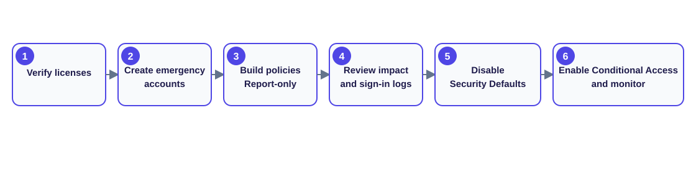

# Day 4: Azure Administration and Identity Security

## Overview

This lesson clarifies administrator permissions, Microsoft 365 and Azure licensing, Security Defaults, Conditional Access, migration planning, user attributes, and authentication features. The key beginner lesson is that a powerful role or purchased subscription does not automatically provide every specialized permission, feature license, or policy configuration.

## Azure portal and specialized roles

A user can be Global Administrator for a tenant and still need additional roles for a particular function. For example, eDiscovery work can require:

- eDiscovery Manager.
- eDiscovery Administrator.

> **Principle:** Global administration does not replace every workload-specific role.

## Microsoft 365 and Azure: license versus subscription

The terms **license** and **subscription** are often used interchangeably, but they have different meanings.

### Microsoft 365 subscription

A Microsoft 365 subscription is an agreement or plan purchased by an organization, such as:

- Microsoft 365 Business Basic.
- Microsoft 365 Business Premium.
- Microsoft 365 E3.
- Microsoft 365 E5.

It defines available services, the number of included licenses, the monthly or annual billing cycle, and the tenant's entitlement.

Example: A company buys Microsoft 365 E3 with 100 seats.

### Microsoft 365 license

A license is one seat from the subscription assigned to a person. Assignment gives the user access to included services.

```text
Subscription: Microsoft 365 E3
Quantity: 100 licenses

Assignments:
User1 → Microsoft 365 E3
User2 → Microsoft 365 E3
User3 → Microsoft 365 E3
```

Think of the subscription as a bus purchased by the company, a license as one seat, and the user as the passenger. Without a seat, the passenger cannot ride.

### Azure subscription

An Azure subscription is a billing and resource-management boundary used to:

- Create Azure resources.
- Track consumption and costs.
- Apply Azure RBAC.
- Set budgets and policies.

Examples include Production, Development, Test, and Sandbox subscriptions.

```text
Production subscription
├── VM01
├── VM02
├── Storage account
└── SQL database
```

### Azure licenses and entitlements

Core Azure resources are generally consumption-based rather than licensed to each user like Microsoft 365. However, some services require licenses or user entitlements, including:

- Microsoft Entra ID P1/P2.
- Azure Virtual Desktop user licensing.
- Microsoft Defender plans.
- Azure DevOps user licenses.

“Azure license” commonly means a service plan, feature entitlement, or user add-on rather than the Azure resource container itself.

| Area | Subscription | License |
|---|---|---|
| Microsoft 365 | Product plan bought by an organization | Entitlement assigned to a user |
| Microsoft 365 example | Microsoft 365 E5 subscription | E5 assigned to Elijah |
| Azure | Billing and resource container | Usually a feature-specific entitlement |
| Azure example | Production subscription | Entra ID P2 |
| Scope | Organization/tenant | User or service |
| Purpose | Makes services available | Grants use of included services |

### Combined real-world example

An organization may own a Microsoft 365 E5 subscription with 500 licenses assigned to Elijah, John, and Mary. It may also have Production, Development, and Sandbox Azure subscriptions. Production hosts a VM and SQL database; Development hosts an App Service and storage account. Separately, Elijah can receive Entra ID P2 and Admin1 can receive Azure DevOps Basic.

## Security Defaults and Conditional Access

Both features protect identities and enforce MFA, but they suit different levels of security maturity.

### Security Defaults

Security Defaults is Microsoft's free, preconfigured tenant baseline. When enabled, it:

- Requires users to register for MFA.
- Requires administrators to use MFA.
- Blocks legacy authentication protocols.
- Protects privileged activities.
- Applies Microsoft-recommended baseline settings automatically.

It is suited to small organizations, startups, tenants without Entra ID P1/P2, or environments needing quick protection with minimal configuration.

### Conditional Access

Conditional Access (CA) is a policy system that evaluates sign-in conditions and allows, blocks, or adds controls such as MFA. It can evaluate:

- User identity.
- Location.
- Device compliance.
- Application.
- Sign-in risk.
- User risk.
- Client application type.

Examples:

- Require MFA outside the corporate network.
- Block specified countries.
- Allow access only from compliant devices.
- Always require stronger authentication for administrators.
- Block risky sign-ins.

| Feature | Security Defaults | Conditional Access |
|---|---|---|
| Cost | Included with Entra ID Free | Requires applicable Entra ID P1/P2 licensing |
| Setup | One-click baseline | Administrator-created policies |
| MFA | Microsoft-controlled | Customizable |
| Legacy authentication | Automatically blocked | Configurable |
| User exceptions | Not supported | Supported |
| Device/location policies | No | Yes |
| Risk policies | No | Yes |
| Control | Limited | Granular |
| Best fit | Small/simple environments | Enterprise environments |

### Scenario comparison

With Security Defaults, Elijah in Rwanda, Charles in Nigeria, and an administrator are all required to use MFA; legacy authentication is blocked. Everyone receives the same baseline without customization.

With Conditional Access, an organization could create:

1. MFA outside trusted locations.
2. MFA for every administrator.
3. A block on sign-ins from high-risk countries.
4. A compliant-device requirement for SharePoint.

Different situations receive different controls.

> **Important:** Security Defaults and Conditional Access policies cannot be active together. Disable Security Defaults when moving to Conditional Access.

### Choosing a feature

Choose Security Defaults when the tenant uses Entra ID Free, needs quick protection, is small, and does not need exceptions or advanced policy logic.

Choose Conditional Access when the tenant has Entra ID P1/P2 and needs granular controls for remote work, Zero Trust, location, device, or risk.

> **Interview answer:** Security Defaults supplies a predefined baseline such as MFA and legacy-authentication blocking. Conditional Access supplies granular policies based on user, location, device, application, and risk. Security Defaults fits basic environments; Conditional Access supports enterprise Zero Trust controls.

## Disable Security Defaults

The notes identify Global Administrator, Security Administrator, or Conditional Access Administrator as roles that can manage Security Defaults.

1. Sign in to the Microsoft Entra admin center.
2. Navigate to **Identity → Overview → Properties**.
3. At the bottom, select **Manage security defaults**.
4. Set **Enable security defaults** to **No**.
5. Save.

> **Warning:** Prepare and validate replacement Conditional Access policies before disabling Security Defaults. Otherwise, the tenant's security posture may be temporarily reduced.

## Conditional Access licensing

Conditional Access requires applicable Microsoft Entra ID Premium licensing:

- Microsoft Entra ID P1.
- Microsoft Entra ID P2.

| Plan | Conditional Access |
|---|---:|
| Microsoft 365 Business Premium | Included |
| Microsoft 365 E3 + Entra ID P1 | Included |
| Microsoft 365 E5 | Included |
| Entra ID P1 standalone | Included |
| Entra ID P2 standalone | Included |
| Microsoft 365 Business Basic | Not included |
| Microsoft 365 Business Standard | Not included |

Conditional Access is a primary reason some organizations move from Business Standard to Business Premium.

## Migrate from Security Defaults to Conditional Access



1. **Verify licensing.** Confirm affected users have Entra ID P1/P2 or a plan that includes it.
2. **Create emergency access accounts.** Prepare at least one or two strong, monitored Global Administrator “break-glass” accounts and exclude them from Conditional Access to prevent tenant lockout.
3. **Recreate the baseline with policies.** Typical policies require MFA for users and administrators, block legacy authentication, optionally require compliant devices, and optionally block risky sign-ins (P2).
4. **Use report-only mode.** Review sign-in logs, user experience, and expected impact before enforcement.
5. **Disable Security Defaults.** The two systems cannot run together.
6. **Enable Conditional Access.** Change validated policies from **Report-only** to **On**, then monitor sign-in logs closely.

## Identity terminology and user administration

- **Azure AD = Microsoft Entra ID:** Old and current product names.
- **AD Connect = Microsoft Entra Connect:** Used to connect an on-premises environment to an Azure/Microsoft Entra tenant.

User attributes are important when creating accounts because they can drive automatic license, policy, and other assignments.

License assignment methods:

- Manual assignment.
- Group-based assignment.

Relevant group types:

- Distribution groups.
- Security groups.

Entra ID roles may be assigned during user creation from the **Assignments** tab.

## Further reading

### Registration campaign

A registration campaign prompts people to register security information. Like reminders for a school trip, it can ask users to add a phone number or email for account recovery.

### Per-user MFA

Per-user MFA requires extra proof for an individual identity. It resembles showing both a theme-park ticket and a hand stamp: the password is one proof, and the second factor is another.

### Self-Service Password Reset

**SSPR** lets a person reset a forgotten password without waiting for IT after completing required identity checks. It is like recovering a locker combination by proving student identity and then choosing a new combination.

| Feature | Memory aid |
|---|---|
| Registration campaign | “Do not forget to sign up.” |
| Per-user MFA | “Show two proofs.” |
| SSPR | “I can securely reset my own password.” |
