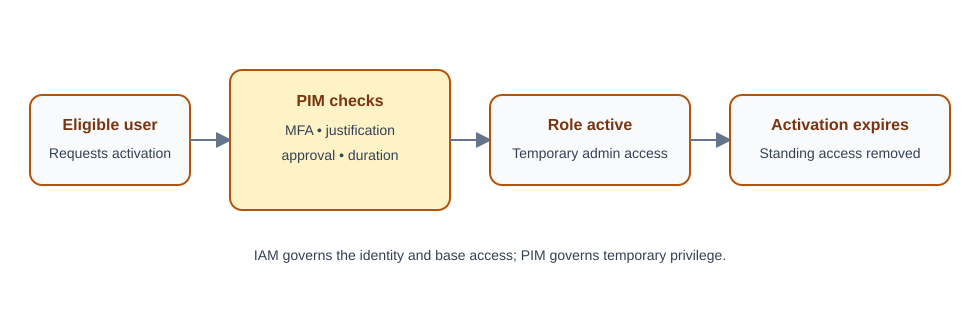

# Day 5: IAM and Privileged Identity Management

## Overview

This lesson distinguishes broad Identity and Access Management (IAM) from Privileged Identity Management (PIM). IAM governs identities and normal access across an organization; PIM adds stronger, often temporary controls for administrator and other privileged roles.

## IAM and PIM compared

**Identity and Access Management (IAM)** is the overall framework for managing identities and access to resources. **Privileged Identity Management (PIM)** focuses specifically on high-impact administrator access.

| Feature | IAM | PIM |
|---|---|---|
| Purpose | Manage identities and access to resources | Govern privileged/admin access with additional controls |
| Users | Users, groups, applications, and devices | Privileged users and administrators |
| Access type | Permanent or standard role assignments | Just-in-time (JIT), temporary privileged access |
| Security | General access control | Enhanced controls for high-privilege roles |
| Approval | Usually not required | Can require approval before activation |
| MFA | Depends on policy | Typically enforced for role activation |
| Auditing | Standard logs | Detailed tracking of privileged actions |
| Risk reduction | Controls who has access | Reduces standing administrative privilege |

## Example

### Standard IAM assignment

John is permanently assigned the User Administrator role. He can manage users at any time, and access remains active until someone removes the assignment.

### PIM-eligible assignment

John is eligible for User Administrator. When he needs it:

1. He activates the role for a limited duration, such as two hours.
2. Activation may require MFA, justification, approval, or a combination of these controls.
3. When the activation period expires, the active privileged access is removed automatically.

## Key PIM benefits

- Reduces the attack surface by minimizing permanent administrator rights.
- Provides just-in-time access.
- Supports approval workflows.
- Can enforce MFA and justification.
- Provides access reviews and detailed auditing.

## PIM within Microsoft Entra

IAM includes identity, authentication, authorization, groups, roles, and access policies. PIM is a Microsoft Entra security capability that can govern privileged roles such as:

- Global Administrator.
- Privileged Role Administrator.
- User Administrator.
- Security Administrator.
- Azure resource roles such as Subscription Owner or Contributor.

## Memory aid

Think of IAM as a building security system that decides who may enter each room. Think of PIM as the vault holding the master keys: an administrator receives a key only when needed and returns it after a limited period.

> **Summary:** IAM asks, “Who should have access?” PIM asks, “How can privileged access be granted securely and temporarily?”
