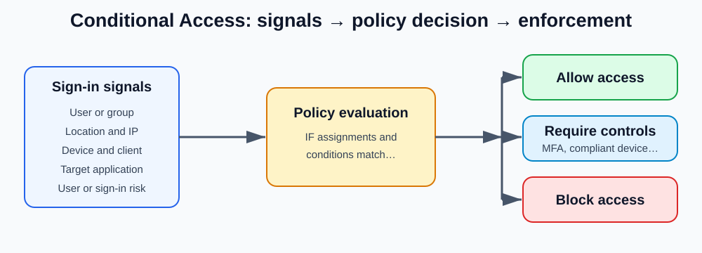

# Day 7: Microsoft Entra Conditional Access

## Overview

This lesson explains how Conditional Access evaluates sign-in signals, makes access decisions, and enforces controls. It covers licensing, report-only testing, the What If tool, locations, device filters, workload identities, Terms of Use, session controls, common use cases, and four practice policies. Beginner-friendly school and workplace comparisons connect each control to a familiar situation.



## Conditional Access Fundamentals

### What Is Conditional Access?

1. Conditional Access is a feature that allows organizations to control access to their resources and applications.
2. It uses policies that monitor sign-in requests and take actions based on defined conditions and rules.
3. Conditional Access is evaluated during user sign-ins, after successful primary authentication.
4. A Microsoft Entra ID (Azure AD) P1 license is required for standard Conditional Access features. A P2 license is required for risk-based policies and Identity Protection capabilities.

## How Conditional Access Works

### Signals (Conditions Evaluated)

Conditional Access uses various signals to evaluate each sign-in attempt:
- User and Location: Who is signing in and from where.
- Device: The device being used to access resources.
- Application: The application being accessed.
- Real-time Risk: The calculated risk level of the sign-in or user.

### Verify Every Access Attempt

Based on the evaluated signals, Conditional Access can:
- ✅ Allow Access
- 🔐 Require Multi-Factor Authentication (MFA)
- ⛔ Block Access

### Apps and Data Protected

Conditional Access helps protect:
- Corporate applications
- Business data
- Cloud resources
- Enterprise services

### Simple Definition

Conditional Access = "If this condition is true, then do this action."

Example:
- If a user signs in from the office → Allow Access
- If a user signs in from a new device → Require MFA
- If a sign-in is detected as risky → Block Access

### Beginner-Friendly Explanation

Imagine your school has a smart security guard at the gate.

Instead of letting everyone in automatically, the guard asks:
- Who are you?
- Where are you coming from?
- What device are you using?
- Does anything look suspicious?

Then the guard decides what to do.

That smart security guard is what Conditional Access does for Microsoft 365 and Azure.

### Step 1: A Sign-In Begins

Let's say Alex wants to open Microsoft Teams.

Before Alex gets access, Conditional Access checks a few things.

### Signals (Clues)

👤 User and Location

Who is signing in? Where are they signing in from?

Example:
- Alex signs in from the school computer in Kigali → Normal ✅
- Alex signs in from another country 5 minutes later → Strange ⚠️

💻 Device
What device is being used?
Example:
- School laptop → Trusted ✅
- Random unknown computer → Be careful ⚠️

📱 Application
What app is being accessed?
Example:
- Reading emails → Low risk ✅
- Accessing payroll or salary information → More sensitive ⚠️

🚨 Real-Time Risk
Microsoft checks whether the sign-in looks dangerous.

Example:
- Correct user, normal location → Low risk ✅
- Password leaked online → High risk 🚨

### Step 2: Conditional Access Makes a Decision

After checking all those clues, it chooses one of three actions.

✅ Allow Access
Everything looks safe.
Example:
- Alex signs in from the usual school laptop using the correct password.

Result:
- 👉 "Welcome in!"

🔐 Require MFA
MFA means Multi-Factor Authentication.
The system asks for an extra proof that it is really Alex.
Example:
- Enter password
- Approve a notification on a phone

Result:
👉 "I believe it's you, but prove it."

⛔ Block Access
The sign-in looks dangerous.

Example:
- Hacker knows Alex's password
- Hacker signs in from another country
- Sign-in is flagged as risky

Result:
👉 "Nope. You can't come in."

Real-Life Example
Think of an ATM card.

Normal Day
- Correct card ✅
- Correct PIN ✅
- Usual location ✅

ATM gives money.
Conditional Access = Allow Access

Slightly Suspicious
- Correct card ✅
- Correct PIN ✅
- New country ⚠️

Bank sends a verification code.

Conditional Access = Require MFA

Very Suspicious
- Stolen card 🚨
- Wrong PIN many times 🚨

Bank locks access.

Conditional Access = Block Access

### The Formula

- IF something happens
- THEN do something

Examples:
- IF user signs in from office
- THEN Allow Access

- IF user signs in from a new device
- THEN Require MFA

- IF sign-in risk is high
- THEN Block Access

### One-Sentence Definition

- Conditional Access is a smart security guard that checks who you are, where you're coming from, what device you're using, and how risky the sign-in looks before deciding whether to allow access, ask for MFA, or block you. 🔐✅⛔

## Conditional Access Components

Conditional Access has 3 main components:

### 1. Signals

These are the pieces of information that Conditional Access looks at before making a decision.
- User/Group membership
- IP Location
- Device
- Application
- Calculated Risk Detection
- Microsoft Defender

### 2. Decisions

Based on the signals received, Conditional Access decides what action to take.

Block Access
- Deny the sign-in attempt.

Grant Access
Allow access, but possibly with additional requirements such as:
- Require MFA
- Require compliant device
- Require hybrid joined device
- Require approved client app or policy

### 3. Enforcement

The application of the decision based on a signal.

In other words, once Conditional Access makes a decision, it enforces (applies) that decision to the user trying to sign in.

### Beginner-Friendly Explanation

Think of Conditional Access as the security guard at a modern school.

The security guard follows three simple steps:

Step 1: Signals (Gather Information)
Before letting someone into the school, the security guard asks:
- Who are you?
- Are you a student, teacher, or visitor?
- Which gate did you come from?
- Are you using a school ID card?
- Does anything look suspicious?

These questions are the signals.

Real Examples

User/Group Membership
- Elijah belongs to the "IT Administrators" group.
- Sarah belongs to the "Finance Team" group.

IP Location
- Elijah signs in from Kigali.
- Someone else tries signing in from another country.

Device
- Elijah uses a company laptop.
- Another person uses an unknown personal computer.

Application
- User wants to open Outlook.
- User wants to access SharePoint.

Calculated Risk Detection
- Microsoft notices the login looks unusual.
- Maybe the user normally signs in from Rwanda but is suddenly signing in from another continent.

Microsoft Defender
- Defender reports the device has malware.
- Defender reports the device is healthy.

Step 2: Decisions (Make a Choice)
After checking all the information, the security guard makes one of two decisions.

Decision A: Block Access 🚫

Security guard says:
- "Something doesn't look right. You cannot enter."

Example:
- Login comes from a high-risk location.
- Device is infected with malware.

Result:
- Access is blocked.

Decision B: Grant Access ✅
Security guard says:
- "You can enter, but first prove you're really you."

The guard may require extra checks.

Require MFA
- "Enter your password and also approve a notification on your phone."

Real life:
- School asks for your ID card plus your fingerprint.

Require Compliant Device
- "Only use devices that follow company security rules."

Real life:
- Only school uniforms are allowed inside the classroom.

Require Hybrid Joined Device
- "Use a device that is registered with the company."

Real life:
- Only school-issued laptops can be used during exams.

Require Approved Client App
- "You must use the official app."

Real life:
- You can enter the school only through the main gate, not by climbing the fence.

Step 3: Enforcement (Apply the Decision)
Now the security guard actually does what was decided.

Examples:

Example 1

Signal:
- User is from IT group.
- Using company laptop.
- Login risk is low.

Decision:
- Grant access.

Enforcement:
- User opens Outlook immediately.

Example 2
Signal:
- User is using a new device.

Decision:
- Require MFA.

Enforcement:
- User must approve a phone notification before access is granted.

Example 3

Signal:
- Defender reports malware.
- Login risk is high.

Decision:
- Block access.

Enforcement:
- User cannot enter the application.

The Simplest Way to Remember It
Conditional Access = Signals → Decisions → Enforcement
- Signals = Gather information.
- Decisions = Decide what to do.
- Enforcement = Apply the decision.

Easy Formula
- IF certain conditions are met (Signals)
- THEN take an action (Decision)
- AND APPLY IT (Enforcement)

Example:
- IF Elijah signs in from a company laptop and risk is low → ALLOW ACCESS.

- IF Elijah signs in from an unknown device → REQUIRE MFA.

- IF the sign-in is risky → BLOCK ACCESS.

## Conditional Access Tools and Controls

01. Report-only Mode
- Enabling a Conditional Access policy may affect a production environment.
- This tool allows administrators to evaluate the impact of a policy before it is fully enabled.
- Results can be reviewed in the Conditional Access sign-in logs.

02. What-if Tool
- The What-if tool allows simulated sign-ins.
- It provides an estimate of how a Conditional Access policy will behave.
- It allows testing with specific users, applications, and conditions.

03. Location Conditions
- Location Conditions allow administrators to apply policies based on location.
- Locations can be filtered by:
  - IP addresses
  - Countries/Regions
  - Named (specified) locations

04. Device Filters and Workload Identities
Device Filters
- Device Filters allow administrators to include or exclude devices from Conditional Access policies.
- Policies can be targeted based on device characteristics.

Workload Identities
- Workload identities allow applications and services to access resources without a human user.
- Workload identities cannot perform MFA.
- Their credentials are typically stored as secrets or certificates.

05. Terms of Use
- Allows administrators to enforce the requirement of consent before accessing an application.
- This is done by requiring users to accept Terms of Use (ToU).

06. Custom Controls
- Allows administrators to redirect users to a compatible external service portal.
- This can satisfy authentication or security requirements outside Azure.
- After the control is completed successfully, the user is redirected back to Azure.
- Currently available as a preview feature.

07. Session Management
- Restricts authentication sessions.
- Controls sign-in frequency (how often users must sign in again).
- Persistent sessions allow users to remain signed in even after closing the browser window.

08. Classical Policies
- Policies created in the legacy (classical) Azure/Intune portal.
- Once disabled, these policies cannot be re-enabled.

### Beginner-Friendly Explanation

Imagine your school is getting a new security system. Before the school turns it on completely, it wants to test everything to make sure nobody accidentally gets locked out.

These tools help the school do that.

### 1. Report-only Mode

Think of this as "practice mode."

The security guard watches everyone entering the school but doesn't actually stop anybody.

Instead, the guard writes notes like:
- "If the new rules were active, Elijah would have been asked for an ID card."
- "Sarah would have been blocked because she came through the wrong gate."

But nobody is actually stopped.

Real-Life Example
Your school wants to require student ID cards.

Before enforcing the rule, the principal watches for a week to see:
- How many students forgot their IDs?
- Who would be affected?
- Would the rule cause problems?

That is exactly what Report-only Mode does.

Why Use It?
Because turning on a policy immediately can accidentally block users.
Report-only Mode lets you see the results first without disrupting anyone.

### 2. What-if Tool

Think of this as a "security simulator."

You ask:
- "What would happen if Elijah tried signing in from a personal laptop in another country?"

The tool predicts the outcome.

Real-Life Example
Like a football coach asking:
- "What if we use this player as a goalkeeper?"

The coach hasn't done it yet but wants to see the likely result.

The What-if Tool asks:
- What user is signing in?
- What device are they using?
- What application are they opening?
- What location are they signing in from?

Then it predicts:
- ✅ Allow Access
- 🔐 Require MFA
- ⛔ Block Access

Why Use It?
You can test policies safely before real users are affected.

### 3. Location Conditions

Think of this as checking where someone is coming from.

The security guard says:
- "People entering from trusted places can come in."

or
- "People entering from risky locations need extra checks."

Real-Life Example
A school has:
- Main entrance
- Side entrance
- Emergency exit

The school trusts students coming through the main entrance.
Students appearing through an unusual entrance may need extra verification.

Microsoft Example
A company may allow sign-ins from:
- Rwanda
- Kenya
- United Kingdom
But block sign-ins from countries where nobody works.

Location Can Be Based On

IP Address
Like a house address for a device on the internet.

Example:
- Office network IP = trusted
- Unknown IP = suspicious

Country/Region
Example:
- User usually signs in from Rwanda.
- Suddenly signs in from another country.

Conditional Access may require MFA.

Named Locations
Administrators can create trusted locations.

Example:
- Kigali Office
- London Office
- Lagos Office

These become recognized trusted places.

### 4. Device Filters

Think of this as checking what device someone is using.

The security guard may say:
- "Only school-issued laptops are allowed."

or
- "Personal devices need extra checks."

Real-Life Example
School rule:
- ✅ School Chromebook → Allowed
- 🔐 Personal Laptop → Extra Verification
- ⛔ Unknown Device → Blocked

Microsoft Example
Policy:
- Include company-managed devices.
- Exclude test devices.
- Apply MFA only to personal devices.

This is done using Device Filters.

### 5. Workload Identities

This is the most confusing one, so let's make it simple.

A workload identity is an application acting like a user.

It is not a real person.

Examples:
- Backup application
- Automation script
- Azure service
- Monitoring tool

These applications need access to resources.

Real-Life Example
- Imagine a cleaning robot in a school.
- The robot needs a room key to do its job.
- The robot is not a student.
- The robot is not a teacher.
- But it still needs access.
- A workload identity is like that robot.

Why Can't It Use MFA?
MFA needs a human to:
- Enter a code
- Approve a notification
- Scan a fingerprint

An application cannot do those things.

So instead, it uses:
- Secrets (password-like credentials)
- Certificates (digital ID cards)

### Putting Everything Together

Imagine Conditional Access is a school security system:

Tool	                School Example
Report-only Mode	    Watch what would happen without enforcing rules
What-if Tool	        Simulate a situation before it happens
Location Conditions     Check which gate or place someone came from
Device Filters	        Check whether they're using a trusted device
Workload Identities 	Let robots and automated systems access resources

### Easy Way to Remember

- Report-only Mode → "Watch"
- What-if Tool → "Predict"
- Location Conditions → "Where are you?"
- Device Filters → "What device are you using?"
- Workload Identities → "Apps acting like users"

So the flow becomes:
User/App → Location Check → Device Check → Policy Evaluation → Allow, Require MFA, or Block Access.

05. Terms of Use (School Rules Agreement)
Before entering the school, you may be asked to read and agree to a set of rules.

For example:
- "No bullying."
- "Use school computers responsibly."
- "Protect your password."

Before you can enter, you must click:

✅ I Agree

Microsoft Example
Before accessing a company application, a user might have to agree to:
- Company security policies
- Data protection rules
- Acceptable use policies

If the user doesn't agree, access can be denied.

Real-Life Example
- Think of a school trip permission form.
- You cannot go on the trip until the form is signed.
- Terms of Use = "Read the rules and agree before entering."

06. Custom Controls (External Security Check)
Sometimes the school's security guard sends visitors to another desk before letting them in.

The guard says:
- "Go to the reception desk first. Once they approve you, come back."

After approval, the visitor returns and is allowed inside.

Microsoft Example
Conditional Access can redirect a user to an external security service that performs:
- Additional identity checks
- Third-party MFA
- Extra compliance checks

After the external service approves the user, Azure allows the sign-in to continue.

Real-Life Example
At an airport:
- Show passport.
- Go through security screening.
- Return to the boarding gate.
- Enter the plane.

Custom Controls = "Get checked somewhere else first."

07. Session Management
This controls how long a user stays signed in.
Think of it like a visitor pass at school.

Sign-in Frequency
The school may say:
- "Show your ID again every 8 hours."

Even if you already entered earlier, you'll need to prove who you are again after a certain amount of time.

Microsoft Example
An organization can require users to:
- Sign in every day
- Sign in every week
- Reauthenticate every few hours

This helps reduce security risks.

Persistent Sessions
This is the opposite.
The school says:
- "Your visitor badge remains valid even if you leave and come back later."

Microsoft Example
A user closes Chrome.
The next day, they reopen Chrome and are still signed into Microsoft 365.
That's because a persistent session was allowed.

### Easy Way to Remember

- Sign-in Frequency = "How often must I prove who I am again?"
- Persistent Session = "Can I stay signed in for longer?"

08. Classical Policies
These are old security rules created using older Azure or Intune portals.
Think of them as old school rules written years ago.

Real-Life Example
Imagine your school had:
- Old rule book (2015)
- New rule book (2026)

The school wants everyone using the new rule book.

If an old rule is retired, the school does not want it turned back on again.

That's similar to Classical Policies.

Microsoft Example
Older Azure/Intune policies have largely been replaced by modern Conditional Access policies.

Once some legacy policies are disabled, they cannot be turned back on.

Putting It All Together
Think of Conditional Access as a smart school security system.

Previous Tools
✅ Report-only Mode → Watch what would happen
✅ What-if Tool → Predict what would happen
✅ Location Conditions → Check where you're signing in from
✅ Device Filters → Check what device you're using
✅ Workload Identities → Allow apps to act like users

New Tools
✅ Terms of Use → Agree to the rules
✅ Custom Controls → Complete an extra check elsewhere
✅ Session Management → Control how long you're signed in
✅ Classical Policies → Old security rules

Super Simple Story
Elijah wants to open Outlook.
- Conditional Access checks where Elijah is signing in from.
- It checks the device Elijah is using.
- It checks whether Elijah agreed to the company Terms of Use.
- It might send Elijah to another security service (Custom Control).
- It decides how long Elijah can stay signed in (Session Management).
- It ignores old legacy policies and follows the new Conditional Access rules.

Result:
- ✅ Allow Access
- 🔐 Require MFA
- ⛔ Block Access

That's Conditional Access in action.

## Why Conditional Access Is Used

Conditional Access is used as a security layer to help protect an organization's resources, applications, and sensitive information.

It safeguards assets and information, including resources deployed within an Azure subscription, such as:
- Virtual Networks (VNets)
- Virtual Machines (VMs)
- Databases
- Storage Accounts
- Information repositories and containers
- Applications
- Sensitive data

In simple terms, Conditional Access helps ensure that only the right people, using the right devices, under the right conditions, can access company resources.

### What Can It Be Used For?

### 1. Enforce MFA

- Usually enforced for administrative users or management tasks.
- Requires users to complete Multi-Factor Authentication (MFA) before access is granted.

### 2. Manage Access

Grant or block access based on:
- Sign-in behavior
- User location
- Other conditions configured in the policy

### 3. Enforce Requirements

- Require certain conditions before access is allowed.
- Example:
  - Require a trusted location before allowing a user to register or set up MFA.

### 4. Device Access

- Control access based on the device being used.
- Enforce and manage access according to device status or compliance.

### 5. Disable Legacy Authentication

- Organizations can block or disable legacy authentication protocols if required.
- This helps reduce security risks from older, less secure authentication methods.

### Beginner-Friendly Explanation

Imagine your school has a very smart security guard protecting:

- Classrooms
- Computer labs
- Student records
- Exam papers
- School laptops

The guard's job is to make sure only the right people get access.

That's exactly what Conditional Access does for a company.

Why Do We Need Conditional Access?
Imagine the school contains valuable things:
- Exam questions
- Student records
- Teacher information
- School computers

The school doesn't want strangers getting access to these things.

So the school creates security rules.

Conditional Access acts like the school's security guard.

### 1. Enforce MFA

What's MFA?

MFA means proving who you are in more than one way.
Instead of only saying:
- "My password is ABC123"

the school may also ask:
- "Show your student ID card."
or
- "Enter the code sent to your phone."

Real-Life Example
You arrive at the school gate.
Security says:
- ✅ Tell me your name.
- ✅ Show me your ID badge.

Only after both checks can you enter.

This is MFA.

Microsoft Example
Elijah signs into the Microsoft Admin Center.
Conditional Access says:
- "Because you're an administrator, approve an MFA notification before we allow access."

### 2. Manage Access

Conditional Access can decide:
- ✅ Let someone in

or

- ⛔ Keep someone out

based on conditions.

Real-Life Example
A school rule says:
- Students may enter classrooms.
- Visitors cannot enter classrooms without permission.

The guard checks who you are and decides.

Microsoft Example

If:
- User is in Rwanda
- Device is trusted

Then:

- Allow access

But:

If:
- User signs in from an unusual country

Then:
- Block access or require MFA

### 3. Enforce Requirements

Sometimes the school says:
- "Before entering, you must meet certain requirements."

Real-Life Example
To enter the science lab:
- ✅ Wear safety goggles
- ✅ Wear a lab coat
- No goggles?
- ⛔ No entry.

Microsoft Example
Conditional Access might require:
- MFA
- A compliant device
- A trusted location
- An approved application

before allowing access.

Example
If Elijah wants to set up MFA:
Conditional Access can say:
- "You must be connected from the company office network before you can register."

This prevents attackers from registering MFA remotely.

### 4. Device Access

Conditional Access can check which device you're using.

Real-Life Example
The school says:
- ✅ School-issued laptop → Allowed
- 🔐 Personal laptop → Extra checks
- ⛔ Unknown device → Blocked

Microsoft Example
If Elijah is using:
- ✅ Company-managed laptop → Access granted

If Elijah is using:
- ❓ Unknown device → MFA required

or

- ⛔ Block access

### 5. Disable Legacy Authentication

This is one of the most important security uses.

What is Legacy Authentication?
Old authentication methods that:
- Don't support MFA
- Don't support modern security features
- Are easier for attackers to abuse

Examples include some older mail protocols such as:
- POP3
- IMAP
- SMTP AUTH

Real-Life Example
Imagine the school still uses an old key from 1995.
Everyone who finds a copy can open the building.

The school decides:
- "Let's stop using the old key and use smart badges instead."

Microsoft Example
Conditional Access can block old sign-in methods and force users to use modern authentication.

This greatly improves security.

### Complete School Example

Imagine Elijah wants to enter the school's exam room.

The security guard checks:
Step 1: Who is Elijah?
- ✅ Student

Step 2: Where is Elijah coming from?
- ✅ Main entrance

Step 3: What device is Elijah using?
- ✅ School laptop

Step 4: Has Elijah completed MFA?
- ✅ Yes

Step 5: Is Elijah using old or modern authentication?
- ✅ Modern authentication

Result
- ✅ Access Granted

However, if Elijah:
- Uses an unknown device
- Refuses MFA
- Signs in from a suspicious location
- Uses a legacy authentication method

Then Conditional Access may:
- 🔐 Require MFA
or
- ⛔ Block Access

### Easy Way to Remember

Conditional Access is used to:
- Protect company resources and data
- Require MFA when needed
- Allow or block access
- Enforce security requirements
- Control which devices can connect
- Block insecure legacy authentication

### Simple Formula

- Right User + Right Device + Right Location + Right Security Checks = Access Granted ✅

Otherwise:
- Access Blocked ⛔

> **Note:** The source note says, “for users with F1 license, it is expected to nr rate.” The intended final phrase is unclear, so it is retained here rather than interpreted.

Authentication Flows - control how your organization uses certain authentication

## Classwork

### 1. Create a Conditional access policy to require compliant or hybrid Azure AD Joined or multifactor authentication for all users

### 2. Create a conditional access policy to require multifactor authentication for Azure management

### 3. Create a policy to require phishing resistant MFA for application Admins

### 4. Require risk remediation for high risk users

## Suggested Solutions

These are four sensible Microsoft Entra Conditional Access policies to configure separately. Build them individually and initially use **Report-only** so you can validate their effects before enforcing them. Microsoft documents Report-only as the starting state for the all-users device/MFA policy and administrator policies.

Further reference: *How to Require Device Compliance with Conditional Access — Microsoft Entra ID | Microsoft Learn*.

### 1. All users: Compliant device OR Hybrid joined OR MFA

In Microsoft Entra admin center → Entra ID → Conditional Access → Policies → New policy:
- Name: CA001 - All Users - Device Trust or MFA
- Users
  - Include: All users
  - Exclude: your emergency access / break-glass accounts
  - If you use Microsoft Entra Connect or Cloud Sync, Microsoft also documents excluding the Directory Synchronization Accounts role.
- Target resources: All resources
- Grant
  - ☑ Require multifactor authentication
  - ☑ Require device to be marked as compliant
  - ☑ Require Microsoft Entra hybrid joined device
- Select Require one of the selected controls
- Enable policy: Report-only
- Select Create.
That “Require one” setting is critical. It gives you:
Compliant device OR Hybrid joined device OR MFA rather than requiring all three simultaneously.

### 2. Require MFA for Azure management

Create another Conditional Access policy.
- Name: CA002 - Azure Management - Require MFA
- Configure the appropriate users for the policy.
- Target your Azure management resources.
- Under Grant, require multifactor authentication.
- Start with Report-only before enforcement.
Microsoft's Conditional Access guidance explicitly identifies Azure management as a common scenario for requiring MFA.

For administrative portals more generally, Microsoft's current guidance also provides the Microsoft Admin Portals resource, covering administrative access such as Microsoft Entra, Microsoft 365, Exchange, and Azure.

### 3. Application Administrators: Require phishing-resistant MFA

I would make this a privileged-role policy rather than targeting individual administrator accounts.
- Name: CA003 - Application Admins - Phishing Resistant MFA
- Users → Include
  - Select Directory roles
  - Select the required built-in administrator role(s), including your Application Administrator role
- Exclude
  - Your designated emergency access / break-glass accounts
- Configure the resources you want protected.
- Under Grant, use Require authentication strength and select the required authentication strength.
- Start with Report-only.
Microsoft recommends phishing-resistant MFA for privileged administrative roles and recommends targeting built-in Directory roles rather than maintaining lists of individual administrator accounts.

### 4. High-risk users: Require risk remediation

For this one, use a risk-based Conditional Access policy rather than a standard MFA-for-everyone policy.
- Name: CA004 - High User Risk - Remediation
- Target the users you need to protect.
- Configure the policy around high user risk.
- Configure remediation according to your organization's requirements.
Microsoft specifically documents a risk policy for requiring a password change for users that are high-risk. It separately documents requiring MFA for medium or high sign-in risk, so do not confuse user risk with sign-in risk.

Risk-based Conditional Access requires Microsoft Entra ID P2 licensing.

### Recommended Final Structure

```text
CA001 - All Users - Device Trust or MFA
  All users
  All resources
  Require one of:
    Compliant device
    OR Entra hybrid joined device
    OR MFA

CA002 - Azure Management - Require MFA
  Azure management resources
  Require: MFA

CA003 - Application Admins - Phishing Resistant MFA
  Directory role: Application Administrator
  Require: Phishing-resistant authentication strength

CA004 - High User Risk - Remediation
  User risk: High
  Require: Risk remediation
```

> **Important:** Keep your emergency access accounts excluded where appropriate, and deploy these in Report-only first. This is particularly important because CA001 targets All users + All resources and can have a very broad impact. Microsoft explicitly recommends excluding emergency access accounts in these configurations.
