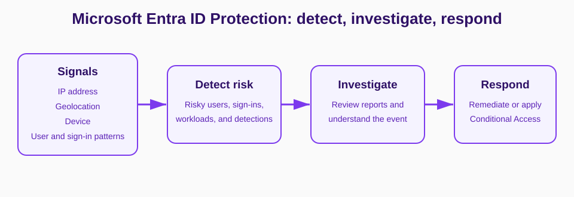

# Day 9: Microsoft Entra ID Protection

## Overview

Microsoft Entra ID Protection detects, reports, and helps remediate identity-related risk. This short lesson distinguishes risk detection from Conditional Access enforcement, summarizes the available risk reports, and records the Azure resource and role prerequisites noted for policy impact analysis.

## Microsoft Entra ID Protection Fundamentals

ID Protection monitors identity-related risks, helps protect identities, and identifies users who have been flagged.

### ID Protection vs. Conditional Access

- **Conditional Access (CA)** applies conditions and actions in response to detected risk.
- **ID Protection** identifies and supports investigation of the detected risk.

### What Is Microsoft Entra ID Protection?

ID Protection helps organizations detect, investigate, and remediate identity-based risks. It uses advanced machine learning to analyze user and sign-in patterns based on signals from sources such as IP addresses, geolocations, and devices.

[Learn more about ID Protection](https://learn.microsoft.com/azure/active-directory/identity-protection/overview-identity-protection?WT.mc_id=Portal-Microsoft_AAD_IdentityProtection)

### What Is Risk?

Risk is an assessment of user actions, authentications, and their associated properties. ID Protection detects identity-based risks and presents this information in risk reports so you can quickly identify and respond to possible threats.

[Learn more about ID Protection risks](https://learn.microsoft.com/azure/active-directory/identity-protection/concept-identity-protection-risks?WT.mc_id=Portal-Microsoft_AAD_IdentityProtection)

### What Are ID Protection Risk Reports?

ID Protection creates reports displaying risky users, risky sign-ins, risky workload identities, and risk detections in your organization. Investigating risk is the first crucial step to better understand and remediate any weak points in your security strategy.

> **Note:** A Log Analytics workspace resource in the Azure portal is needed to manage Risk Policy Impact Analysis.

This resource is subscription-based. To work with ID Protection:

- Create the resource.
- Assign the **Contributor** role on that resource.

ID Protection uses signals including:

- IP address
- Geolocation

The operational flow recorded in the source is:

- **Identity Protection:** detect risk.
- **Protect:** respond to risk.
- **Report:** investigate risk.

## Further Reading

- Tenant threshold
